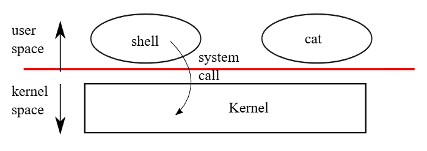

# Chapter 1：Operating system interfaces

作業系統的任務，是要讓多個程式能夠共享同一部電腦，並提供比硬體本身更多、更加實用的功能。 作業系統負責管理並抽象化底層硬體，使得例如文字處理器這類應用程式無需關心所使用的是哪一種磁碟硬體。 作業系統能讓多個程式共享硬體資源，並使它們能夠同時執行（或至少看起來是同時執行）。 最後，作業系統還提供讓程式之間可以互相溝通的介面，使它們能夠共享資料或協同作業

作業系統透過一組介面來向使用者程式提供服務，但要設計一個好的介面其實並不容易。 一方面，我們希望這個介面要簡單且精確，這樣比較容易實作正確； 但另一方面，我們又會想要提供許多進階的功能給應用程式使用。 解決這個矛盾的訣竅是：設計一組依賴少量機制的介面，並讓這些機制可以組合起來，提供高度的通用性

本書將使用一個具體的作業系統作為例子，來說明作業系統的各種概念。 這個作業系統叫做 xv6，它提供了 Ken Thompson 與 Dennis Ritchie 在 Unix 作業系統中所引入的基本介面，並且模仿了 Unix 的內部設計。 Unix 提供的介面通常「精準但可組合性強」，這讓它意外地擁有很高的通用性。 由於這種介面設計地非常成功，以至於現代的作業系統，例如 BSD、Linux、macOS、Solaris，甚至在某種程度上連 Microsoft Windows 都擁有類 Unix 的介面。 而理解 xv6，是理解這些系統（還有許多其他系統）的一個很好的起點

如圖 1 所示，xv6 採用了傳統的核心（kernel）架構，也就是一個特殊的程式，專門提供執行中程式所需的服務。 每個執行中的程式稱為一個「行程（process）」，它的記憶體會包含指令區、資料區，以及堆疊（stack）。 指令負責實作該程式的運算邏輯； 資料則是程式操作的變數； 堆疊則負責組織與管理程式的函式呼叫。 一台電腦通常會同時擁有許多個行程，但只會有一個核心

當一個行程需要呼叫核心的服務時，它會發出一個「系統呼叫」，也就是作業系統介面中的一種呼叫方式。 這個系統呼叫會進入核心，接著核心會執行所請求的服務並返回。 因此一個行程的執行會在使用者空間與核心空間之間交替進行

如後續章節將詳細說明的，核心會使用 CPU 提供的硬體保護機制（本書使用 CPU 一詞來指稱執行運算的硬體元件； 其他文件，如 RISC-V 規格，會使用 processor、core 或 hart 等詞來代替 CPU），來確保每個在使用者空間中執行的行程只能存取自己的記憶體。 核心本身會於具備特權的硬體模式執行，以實作這些保護機制； 而使用者程式則在沒有這些特權的情況下執行。 當一個使用者程式發出系統呼叫時，硬體會提升執行權限，並開始執行核心中事先安排好的函式

使用者程式所能看見的介面由核心提供的所有系統呼叫組成。 xv6 核心提供了一部分傳統 Unix 核心所具備的服務與系統呼叫。 圖 1.2 列出了 xv6 所提供的全部系統呼叫

本章接下來將粗略地介紹 xv6 所提供的幾項服務，包含行程管理、記憶體、檔案描述符（file descriptors）、管道（pipes），以及檔案系統，並透過程式碼範例與說明，來展示 Unix 的命令列介面 shell 是如何使用這些功能。 從 shell 對系統呼叫的使用方式，可以看出這些呼叫是如何被精心設計的

shell 是一個普通的程式，它負責讀取使用者輸入的指令並執行。 其為一個使用者程式，而不是核心的一部分，這點凸顯了系統呼叫介面的強大之處：shell 並不是什麼特別的程式。 這也代表 shell 很容易被替換； 因此，現代的 Unix 系統都有各式各樣的 shell 可供選擇，每種 shell 都有自己獨特的使用者介面與腳本功能。 xv6 的 shell 是 Unix Bourne shell 精神的一個簡單實作，其程式碼可以在 `user/sh.c:1` 內找到
