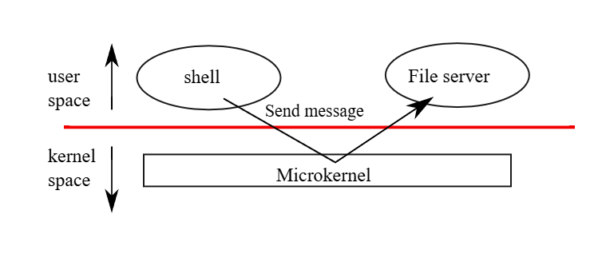
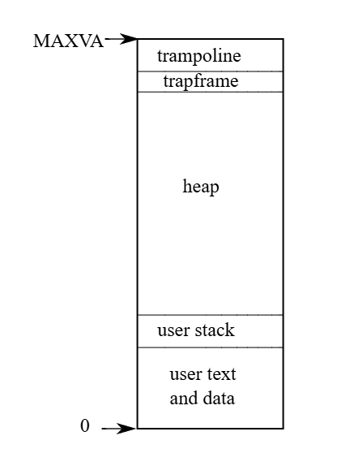

# Chapter2：Operating system organization

作業系統的一項關鍵需求是要能夠同時支援多個活動，例如透過第一章所描述的系統呼叫介面，一個行程可以使用 `fork` 建立新的行程。 作業系統還必須在這些行程之間分時共享電腦的資源，例如即使行程數量超過了硬體 CPU 的數量，作業系統仍必須確保所有行程都能獲得執行的機會。 作業系統也必須在行程之間安排隔離機制，換句話說如果某個行程出現錯誤並發生故障，它不應該影響到那些不依賴它的行程。 然而，完全的隔離又過於強硬，因為行程之間應要可以有意地互動，例如管道（pipeline）就是一個例子。 因此，作業系統必須滿足三個需求：多工（multiplexing）、隔離（isolation）與互動（interaction）

本章將概述作業系統是如何組織架構，以實現這三項需求。 事實上，有許多不同的方式可以達成，但本書聚焦於以「整體式核心（monolithic kernel）」為中心的主流設計，這種設計被許多 Unix 作業系統所採用。 本章也會簡要說明 xv6 中的行程，它是 xv6 中實現隔離的基本單位，以及 xv6 啟動時建立第一個行程的過程

xv6 執行於一顆「多核心（multi-core）」的 RISC-V 微處理器上，其許多底層功能（例如行程的實作）都依賴於 RISC-V 架構。 RISC-V 是一種 64 位元的 CPU，而 xv6 是使用 "LP64" 模式的 C 語言撰寫的，這表示在 C 語言中，`long`（L）與指標（P）是 64 位元，而 `int` 則是 32 位元。 本書假設讀者已具備某些架構上機器層級（machine-level）的程式設計經驗，並會在需要時介紹與 RISC-V 有關的概念。 完整的 RISC-V 規格可以參考使用者層級 ISA 文件與特權層級架構文件。 你也可以參考《The RISC-V Reader: An Open Architecture Atlas》一書

在一台完整的電腦中，CPU 周圍會有許多輔助硬體，其中大部分以 I/O 介面的形式存在。 xv6 是針對 qemu 的 `-machine virt` 選項所模擬的這些輔助硬體所撰寫的。 這些硬體包括：RAM、一個包含開機程式的 ROM、一條與使用者鍵盤與螢幕相連的序列埠，以及一個用於儲存的硬碟

## 2.1 Abstracting physical resources

當人們第一次接觸作業系統時，可能會問的第一個問題是：為什麼需要作業系統？ 也就是說，可以將上一章的圖 1.2 中的系統呼叫全部實作成一個函式庫，應用程式只要連結該函式庫即可。 在這樣的設計下，每個應用程式甚至可以擁有一套量身打造的函式庫。 應用程式可以直接與硬體資源互動，並以最適合該應用的方式使用這些資源（例如，達成高效或可預期的效能）。 有些為嵌入式裝置或即時系統所設計的作業系統就是採用這種方式來組織的

這種函式庫式作法的缺點是，如果有多個應用程式同時執行，那麼這些應用程式必須都要是「行為良好（well-behaved）」的。 例如，每個應用程式都必須定期主動讓出 CPU，讓其他應用程式能夠執行。 這種「協作式（cooperative）」的分時機制，在所有應用程式彼此信任、而且沒有錯誤的情況下也許可以接受。 但在現實中，應用程式通常不會彼此信任，而且經常會有錯誤，因此我們常常需要比協作式更強的隔離機制

為了達成強隔離，禁止應用程式直接存取敏感的硬體資源，取而代之的將這些資源抽象成服務是有幫助的。 例如，Unix 應用程式與儲存裝置的互動只能透過檔案系統提供的 `open`、`read`、`write` 和 `close` 等系統呼叫，而不是直接對硬碟進行讀寫。 這不僅提供了路徑名稱的便利性，也讓作業系統作為該介面的實作者能夠管理硬碟。 即使隔離不是主要考量，有意互動的程式（或是只是想避免彼此干擾）也會發現檔案系統比直接使用硬碟來得更加方便

同樣地，Unix 能夠在不同的行程之間透明地切換硬體 CPU，並在需要時儲存與還原暫存器狀態，使得應用程式無需關心分時的細節。 這種透明性讓作業系統即使在有些應用程式陷入無窮迴圈的情況下，仍能實現 CPU 的共享

另一個例子是，Unix 的行程使用 `exec` 來建立它們的記憶體映像，而不是直接操作實體記憶體。 這樣一來，作業系統可以決定將行程放置在哪個記憶體位置； 如果記憶體不足，作業系統甚至可以把行程的一部分資料存放到硬碟上。 `exec` 也讓使用者能夠利用檔案系統來方便地儲存可執行的程式映像檔

Unix 行程之間的許多互動形式都是透過檔案描述符進行的。 檔案描述符不僅將許多細節（例如管道或檔案中的資料儲存位置）抽象化，且其設計方式也簡化了行程間的互動。 例如，如果管線中的某個應用程式失敗，核心會為下一個行程產生一個 end-of-file 訊號

圖 1.2 所示的系統呼叫介面經過了精心設計，以同時提供程式開發者的便利性與實現強隔離的可能性。 Unix 所採用的這種資源抽象方式並不是唯一的做法，但實踐證明它是一種有效的方法

## 2.2 User mode, supervisor mode, and system calls

強隔離（strong isolation）需要在應用程式與作業系統之間設置一個嚴格的邊界。 如果某個應用程式出錯，我們不希望其會導致整個作業系統或其他應用程式也發生錯誤。 相反地，作業系統應該能夠清除這個失敗的應用程式，並繼續執行其他應用程式。 為了實現強隔離，作業系統使應用程式無法修改（甚至是讀取）作業系統的資料結構與指令，並且也無法存取其他行程的記憶體

CPU 提供了實現強隔離的硬體支援。 例如，RISC-V 擁有三種 CPU 執行指令的模式：machine mode（機器模式）、supervisor mode（監督者模式）、以及 user mode（使用者模式）。 在 machine mode 下執行的指令擁有完全的權限，CPU 啟動時會從 machine mode 開始。 machine mode 主要用於開機時對電腦進行初始化設定，xv6 只會在 machine mode 執行幾行程式碼，接著就會切換至 supervisor mode

在 supervisor mode 中，CPU 可以執行特權指令，例如啟用或關閉中斷、讀取與寫入頁表位址所儲存的暫存器等等。 如果某個處於 user mode 的應用程式試圖執行特權指令，CPU 不會執行該指令，而是會切換至 supervisor mode，讓 supervisor-mode 的程式碼能夠終止該應用程式，因為它做了不該做的事情。 第一章中的圖 1.1 說明了這種架構，應用程式只能執行 user-mode 的指令（例如加法等），稱為在 user space（使用者空間）中執行； 而 supervisor mode 的軟體則還能執行特權指令，稱為在 kernel space（核心空間）中執行。 執行於 kernel space（或 supervisor mode）的軟體被稱為核心（kernel）

應用程式無法直接呼叫核心函式，若其想要呼叫某個核心功能（例如 xv6 中的 `read` 系統呼叫），則必須轉移至核心。 CPU 提供了一條特殊的指令，用來將 CPU 從 user mode 切換到 supervisor mode，並從由核心指定的進入點進入核心（RISC-V 提供的 `ecall` 指令就是為此目的而設計的）。 一旦 CPU 切換到 supervisor mode，核心便能驗證該系統呼叫的參數（例如檢查傳入的記憶體位址是否屬於應用程式的範圍），決定應用程式是否有權執行該操作（例如檢查應用程式是否有權寫入指定檔案），然後決定是要拒絕還是執行該請求。 由核心控制切換到 supervisor mode 的進入點是非常重要的，如果應用程式能夠自行決定核心的進入點，惡意應用就可能從繞過參數驗證的位置進入核心

## 2.3 Kernel organization

一個關鍵的設計問題是：作業系統的哪些部分應該在 supervisor mode（監督者模式）下執行。 其中一種可能的做法是讓整個作業系統都駐留在核心中，這樣所有系統呼叫的實作都會在 supervisor mode 下執行，這種架構被稱為單體核心（monolithic kernel）

在這種架構中，整個作業系統是由一個在擁有完整硬體特權下執行的單一程式所構成。 這樣的設計相對方便，因為作業系統設計者不需要判斷作業系統中哪些部分不需要完整的硬體權限。 此外，作業系統的不同組件之間也會更容易合作，例如作業系統可能有一個緩衝區快取（buffer cache），可供檔案系統與虛擬記憶體系統共用

單體架構的缺點是：作業系統中不同部分的互動通常很複雜（如本書後續會提到），因此作業系統開發者很容易犯錯。 在單體核心中，錯誤通常是致命的，因為在 supervisor mode 發生錯誤往往會導致整個核心崩潰。 若核心失效，整台電腦就會停止運作，所有應用程式也都會失效，此時就必須重新啟動電腦

為了降低核心錯誤所帶來的風險，作業系統設計者可以儘量減少在 supervisor mode 下執行的作業系統程式碼，並將大部分作業系統的功能放在 user mode 執行，這種核心架構被稱為微核心（microkernel）

圖 2.1 說明了微核心的設計，在該圖中，檔案系統是一個以 user-level 執行的行程。 以行程形式執行的作業系統服務被稱為伺服器（servers）。 為了讓應用程式能夠與檔案伺服器互動，核心提供了一種「行程間通訊（inter-process communication）」機制，使得一個 user-mode 行程可以向另一個行程發送訊息。 例如，若像 shell 這樣的應用程式想讀寫一個檔案，它會傳送一個訊息給檔案伺服器並等待回覆

在微核心架構中，核心介面只包含一些低層次的功能，例如啟動應用程式、傳送訊息、存取裝置硬體等。 這樣的設計使得核心本身能夠保持相對簡單，因為大部分的作業系統功能都由 user-level 的伺服器來負責

在現實世界中，單體核心與微核心這兩種架構都很流行。 許多 Unix 核心採用單體架構，例如 Linux 就是一個單體核心，但其中也有些作業系統功能是以 user-level 伺服器執行的（例如視窗系統）。 Linux 能為作業系統密集型的應用提供高效能環境，有部分就是因為核心子系統之間可以高度整合

像 Minix、L4 以及 QNX 等作業系統採用了微核心加伺服器的架構，並且在嵌入式環境中被廣泛使用。 L4 的一個變種「seL4」甚至小到足以被形式化驗證其記憶體安全性與其他安全特性[[1]](#1)。 作業系統開發者之間對於哪種架構較佳有許多爭論，目前也沒有哪一種架構優於另一種的明確證據。 此外，這也很取決於「較佳」的定義是什麼：更高的效能、更小的程式碼體積、更可靠的核心、更可靠的整體作業系統（包含使用者層服務）等等

實務上還有一些考量可能比架構選擇更重要。 有些作業系統採用微核心，但會將部分原本屬於 user-level 的服務放到 kernel space 中執行，以提高效能。 有些作業系統之所以維持單體核心，是因為它們最初就是這樣設計的，而將現有系統重寫成純微核心設計所需的代價太高，相較之下新增功能可能更值得投入

從本書的觀點來看，微核心與單體核心作業系統共享許多核心概念：它們實作系統呼叫、使用頁表、處理中斷、支援行程、使用鎖來控制並發、實作檔案系統等等。 本書將聚焦於這些核心概念

xv6 是以單體核心的方式實作的，與大多數 Unix 作業系統相同。 因此，xv6 的核心介面即對應作業系統的介面，且該核心實作了完整的作業系統。 雖然 xv6 並未提供太多服務，其核心的規模甚至比某些微核心還小，但在概念上，xv6 屬於單體核心

## 2.4 Code: xv6 organization

xv6 的核心原始碼位於 `kernel/` 子目錄中。 這些原始碼按照一種粗略的模組化概念分為多個檔案，下方的表格列出了這些檔案。 各模組間的介面定義在 `defs.h`（[kernel/defs.h](https://github.com/mit-pdos/xv6-riscv/blob/riscv//kernel/defs.h)）中

| File             | Description                                              |
|------------------|----------------------------------------------------------|
| bio.c            | Disk block cache for the file system.                   |
| console.c        | Connect to the user keyboard and screen.                |
| entry.S          | Very first boot instructions.                           |
| exec.c           | exec() system call.                                     |
| file.c           | File descriptor support.                                |
| fs.c             | File system.                                            |
| kalloc.c         | Physical page allocator.                                |
| kernelvec.S      | Handle traps from kernel.                               |
| log.c            | File system logging and crash recovery.                 |
| main.c           | Control initialization of other modules during boot.    |
| pipe.c           | Pipes.                                                  |
| plic.c           | RISC-V interrupt controller.                            |
| printf.c         | Formatted output to the console.                        |
| proc.c           | Processes and scheduling.                               |
| sleeplock.c      | Locks that yield the CPU.                               |
| spinlock.c       | Locks that don't yield the CPU.                         |
| start.c          | Early machine-mode boot code.                           |
| string.c         | C string and byte-array library.                        |
| swtch.S          | Thread switching.                                       |
| syscall.c        | Dispatch system calls to handling function.             |
| sysfile.c        | File-related system calls.                              |
| sysproc.c        | Process-related system calls.                           |
| trampoline.S     | Assembly code to switch between user and kernel.        |
| trap.c           | C code to handle and return from traps and interrupts.  |
| uart.c           | Serial-port console device driver.                      |
| virtio_disk.c    | Disk device driver.                                     |
| vm.c             | Manage page tables and address spaces.                  |

（Figure 2.2: Xv6 kernel source files.）

## 2.5 Process overview

在 xv6（以及其他 Unix 作業系統）中以「行程」作為隔離的單位。 行程這種抽象化可以防止一個行程破壞或窺探其他行程的記憶體、CPU、檔案描述符等資源。 它也防止行程破壞核心本身，因此行程無法破壞核心提供的隔離機制。 核心在實作行程的抽象化時必須格外謹慎，因為一個有漏洞或惡意的應用程式可能會誘使核心或硬體執行某些不應發生的行為（例如繞過隔離機制）。 核心用來實現行程的機制包括：使用者模式／監督者模式的旗標（user/supervisor mode flag）、位址空間（address space），以及執行緒的時間分配（time-slicing）

為了加強隔離效果，行程的抽象會給程式一種錯覺，好像它擁有一台屬於自己的私有機器。 行程為程式提供一個看起來是私有的記憶體系統，也就是位址空間（address space），其他行程無法讀寫這個空間。 行程也讓程式感覺它擁有自己的 CPU 來執行其指令

xv6 使用頁表（由硬體實作）來為每個行程提供自己的位址空間。 RISC-V 的頁表會將虛擬位址（即 RISC-V 指令操作的位址）轉換（或稱「映射」）為實體位址（也就是 CPU 寄給主記憶體的位址）

xv6 為每個行程維護一份獨立的頁表，來定義該行程的位址空間。 如圖 2.3 所示，一個位址空間包含該行程的使用者記憶體（user memory），其從虛擬位址 0 開始。 最前面是程式的指令，接著是全域變數，再來是堆疊（stack），最後是用於 `malloc` 的「堆積區（heap）」，其可視需要擴展。 行程位址空間的最大大小受到幾個因素限制，首先 RISC-V 的指標寬度為 64 位元，但硬體在查詢頁表時只使用其中的低 39 位，而 xv6 又只使用了這 39 位中的前 38 位，因此最大可用位址為 238 - 1，即 `0x3fffffffff`，也就是 `MAXVA`（定義於 [kernel/riscv.h:382](https://github.com/mit-pdos/xv6-riscv/blob/riscv//kernel/riscv.h#L382)）

在位址空間的頂端，xv6 配置了一頁（4096 bytes）的跳板區（trampoline）和一頁的陷阱框架區（trapframe）。 xv6 利用這兩個頁面來實作從使用者模式轉入核心模式再返回的機制，跳板頁面中含有切換模式所需的程式碼，而陷阱框架頁面則用來儲存行程的使用者暫存器，這在第四章中會進一步解釋

xv6 的核心為每個行程維護許多狀態，這些狀態集中存放在 `struct proc` 結構中（定義於 [kernel/proc.h:85](https://github.com/mit-pdos/xv6-riscv/blob/riscv//kernel/proc.h#L85)）。 對一個行程來說，最重要的核心狀態包含其頁表、核心堆疊（kernel stack），以及執行狀態（run state）。 本文中將使用 `p->xxx` 的方式來表示 `proc` 結構中的成員，例如 `p->pagetable` 表示該行程的頁表指標

每個行程都有一個控制執行的執行緒（簡稱 thread），它保存著執行該行程所需的狀態。 在任一時間點，一個執行緒可能會在某個 CPU 上執行，或者處於暫停狀態（暫時未執行，但未來可以恢復執行）。 為了讓 CPU 能在不同行程之間切換，核心會將當前在該 CPU 上執行的執行緒暫停，並儲存它的狀態，然後恢復另一個行程中先前已暫停的執行緒狀態。 執行緒的大部分執行狀態（例如區域變數、函式呼叫的返回位址）會儲存在該執行緒的堆疊中

每個行程有兩個堆疊：一個使用者堆疊和一個核心堆疊（`p->kstack`）。 行程執行使用者指令時僅會使用它的使用者堆疊，核心堆疊是空的。 當行程進入核心（例如發出系統呼叫或中斷）時，核心會在該行程的核心堆疊上執行； 而當行程處於核心中時，其使用者堆疊仍保留著資料，但不會被積極使用。 行程的執行緒會在使用者堆疊與核心堆疊之間交替使用。 核心堆疊是獨立且受保護的，因此即使某行程損壞了自己的使用者堆疊，核心仍然能正常執行

一個行程可以透過執行 RISC-V 的 `ecall` 指令來發出系統呼叫。 這個指令會提高硬體的權限等級，並將程式計數器設為核心定義的進入點。 該進入點的程式碼會切換至該行程的核心堆疊，並執行實作該系統呼叫的核心程式碼。 當系統呼叫結束後，核心會切換回使用者堆疊，並透過執行 `sret` 指令返回使用者空間，此指令會降低硬體權限等級，並從之前的系統呼叫指令之後繼續執行使用者指令。 一個行程的執行緒可能會在核心中「阻塞」，以等待 I/O 操作完成，而當 I/O 結束後，該執行緒可以從原先中斷的地方繼續執行

`p->state` 表示該行程的狀態，包括是否已分配、是否準備執行、是否正在 CPU 上執行、是否正在等待 I/O，或是否正在結束階段。 `p->pagetable` 儲存該行程的頁表，其格式符合 RISC-V 硬體的要求。 當 xv6 在使用者空間中執行某個行程時，會讓分頁硬體使用該行程的 `p->pagetable`。 此外，行程的頁表也記錄了配置給該行程記憶體所對應的實體頁面位址

總結來說，行程結合了兩個設計概念：位址空間，讓行程產生擁有獨立記憶體的錯覺； 以及執行緒，讓行程感覺擁有自己的 CPU。 在 xv6 中，一個行程包含一個位址空間與一個執行緒。 而在實際的作業系統中，一個行程可能會包含多個執行緒，以善用多核心 CPU 的計算資源

## 2.6 Code: starting xv6, the first process and system call

為了讓 xv6 更具體易懂，我們將簡要地說明核心如何啟動並執行第一個行程。 後續的章節將會更詳細地介紹本概要中提到的機制。 當 RISC-V 電腦開機時，它會先進行初始化，接著執行儲存在唯讀記憶體中的啟動載入器（boot loader）。 這個 boot loader 將 xv6 核心載入到記憶體中。 然後，在 machine mode 下，CPU 會從 `_entry` 開始執行 xv6。 此時 RISC-V 的分頁硬體尚未啟用，因此虛擬位址會直接對應到實體位址

boot loader 會將 xv6 核心載入至記憶體中的實體位址 `0x80000000`。 之所以不是放在 `0x0`，是因為從 `0x0` 到 `0x80000000` 的位址範圍被保留給了 I/O 裝置使用

`_entry` 處的指令會建立一個堆疊，讓 xv6 能夠執行 C 程式碼。 xv6 在 `start.c`（[kernel/start.c:11](https://github.com/mit-pdos/xv6-riscv/blob/riscv//kernel/start.c#L11)）中宣告了一個初始堆疊區域 `stack0`。 `_entry` 的程式碼將堆疊指標（`sp`）設為 `stack0 + 4096`，即堆疊頂端，因為在 RISC-V 中堆疊是向下成長的。 現在核心已有堆疊，`_entry` 接著呼叫位於 `start`（[kernel/start.c:15](https://github.com/mit-pdos/xv6-riscv/blob/riscv//kernel/start.c#L15)）的 C 函式

`start` 函式會進行一些只能在 machine mode 下執行的設定，然後切換到 supervisor mode。 為了進入 supervisor mode，RISC-V 提供了 `mret` 指令，這個指令通常用來從一個 supervisor mode 對 machine mode 的呼叫中返回。 然而 `start` 並非是從這類呼叫返回的，不過它會模擬那種情境：它會在 `mstatus` 暫存器中設定前一個權限模式為 supervisor，將 `main` 的位址寫入 `mepc` 暫存器中作為返回位址，將 `satp` 設為 0 以停用 supervisor mode 下的虛擬位址轉譯，並將所有中斷與例外的處理委託給 supervisor mode

::: tip  
`mret` 通常用來從 machine mode「回去」到 supervisor mode，也就是說前面會有個 supervisor mode 進到 machine mode 的呼叫／過程。 但 xv6 中開機過渡到 supervisor mode 的前面並沒有「S 進到 M 的過程」，只是利用它來進到 supervisor mode 而已  
:::

在進入 supervisor mode 之前，`start` 還要做一件事：設定時鐘晶片，使其產生定時中斷。 這些前置作業完成後，`start` 便會透過呼叫 `mret`「返回」到 supervisor 模式。 這會讓程式計數器跳躍到 `main`，也就是先前寫入 `mepc` 的位址

當 `main` 初始化完若干裝置與子系統後，會透過呼叫 `userinit` 建立第一個行程。 這個第一個行程會執行一段以 RISC-V 組合語言撰寫的小程式，並發出 xv6 中的第一個系統呼叫。 `initcode.S` 會將 `exec` 系統呼叫的編號 `SYS_EXEC` 載入暫存器 `a7`，然後執行 `ecall` 指令以重新進入核心

核心會在 `syscall` 中使用暫存器 `a7` 內的數值來呼叫對應的系統呼叫。 系統呼叫表會將 `SYS_EXEC` 映射到函式 `sys_exec`，接著核心會呼叫該函式。 正如我們在 UNIX 章節中所看到的，`exec` 會用新的程式（這裡是 `/init`）取代目前行程的記憶體與暫存器內容

一旦核心執行完 `exec`，它會返回到 `/init` 行程的使用者空間。 `init` 會在需要時建立一個新的主控台裝置檔案，然後將其分別以檔案描述符 0、1 和 2 打開。 接著，它會在主控台上啟動一個 shell，此時，系統便已啟動完成

## 2.7 Security Model

你可能會好奇作業系統會如何處理有漏洞或惡意的程式碼。 由於應對惡意行為比起處理意外的程式錯誤要困難得多，因此作業系統主要會著重於防範惡意行為。 接下來我們會對作業系統設計中典型安全假設與目標的做個高層次概述

作業系統必須假設某個行程的使用者層程式碼會盡可能地破壞核心或其他行程。 使用者程式碼可能會試圖解參考超出其被允許存取的位址空間的指標； 可能會嘗試執行任何 RISC-V 指令，甚至是那些原本不給使用者程式使用的指令； 可能會試圖讀寫任何 RISC-V 控制暫存器； 可能會直接存取硬體裝置； 還可能會傳遞巧妙設計過的值給系統呼叫，企圖誘使核心當機或做出愚蠢的行為。 核心的目標是限制每個使用者行程，使其只能讀取、寫入、執行它自己的使用者記憶體，只能使用 RISC-V 的 32 個通用暫存器，並且只能透過系統呼叫所允許的方式來影響核心與其他行程。 核心必須防止任何其他行為的發生。這通常是核心設計中絕對必要的要求

對於核心自身的程式碼，所抱持的期望則完全不同，核心程式碼被假設為由善意且謹慎的程式設計師所撰寫。 因此我們預期核心程式碼是沒有錯誤的，當然也不會包含任何惡意行為。 這個假設會影響我們分析核心程式碼的方式，例如，有許多內部核心函式（例如 spin lock）如果被錯誤使用會造成嚴重問題。 在檢查任何特定的核心程式碼時，我們會希望能夠確信它的行為是正確的。 不過，我們仍假設整體來說核心程式碼是被正確撰寫的，並且遵循所有使用核心內部函式與資料結構的規則。在硬體層面上，RISC-V 的 CPU、RAM、硬碟等也被假設會如同其說明文件所述那樣正常運作，並且不存在硬體錯誤

當然，現實中的情況並不那麼單純，你很難防止聰明的使用者程式碼透過消耗核心保護的資源（如磁碟空間、CPU 時間、行程表中的槽位等）使系統變得不可用（或導致系統 panic）。 通常要撰寫完全無錯誤的核心程式碼或設計毫無缺陷的硬體是幾乎不可能的； 如果惡意程式的作者發現了核心或硬體的漏洞，他們就會加以利用。 即使是在像 Linux 這樣成熟且被廣泛使用的核心中，人們仍不斷發現新的安全漏洞。 為了應對核心自身可能有錯的情況，在核心中設計保護措施是值得的：如 assert、型別檢查、堆疊防護頁等

最後，使用者與核心程式碼之間的界線有時並不那麼清楚：某些具有特權的使用者層行程可能會提供重要服務，因此其實際上也會成為作業系統的一部分； 而在某些作業系統中，特權使用者程式甚至可以將新的程式碼插入核心（例如 Linux 的可載入核心模組機制）

## 2.8 Real world

大多數作業系統都採用了行程的概念，而大多數行程的樣貌也與 xv6 的類似。 然而，現代作業系統會支援一個行程內有多個執行緒，以便讓單一行程能利用多顆 CPU。 在一個行程內支援多執行緒需要相當多的機制，而 xv6 並不具備這些，這通常也包括一些介面的變動（例如 Linux 的 `clone`，它是 `fork` 的一種變體），用以控制執行緒之間共享行程的哪些部分

## 2.9 Exercises

1. 為 xv6 新增一個系統呼叫，回傳目前可用的記憶體總量

## Bibliography

- <a id="1">[1]</a>：Gerwin Klein, Kevin Elphinstone, Gernot Heiser, June Andronick, David Cock, Philip Derrin, Dhammika Elkaduwe, Kai Engelhardt, Rafal Kolanski, Michael Norrish, Thomas Sewell, Harvey Tuch, and Simon Winwood. Sel4: Formal verification of an OS kernel. In Proceedings of the ACM SIGOPS 22nd Symposium on Operating Systems Principles, page 207–220, 2009.
