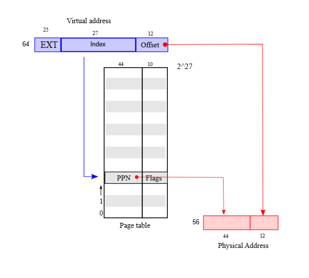
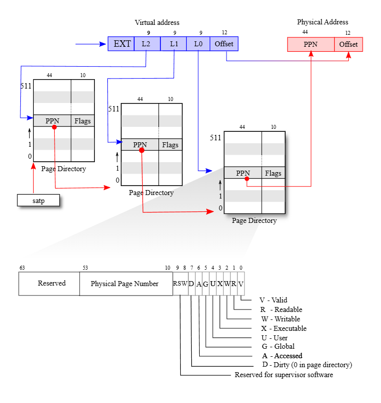
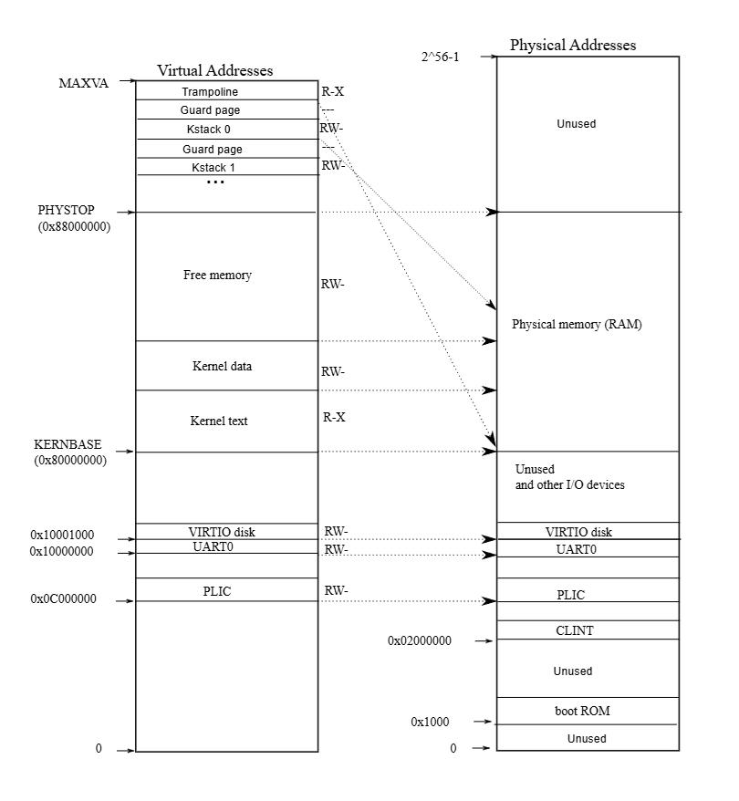
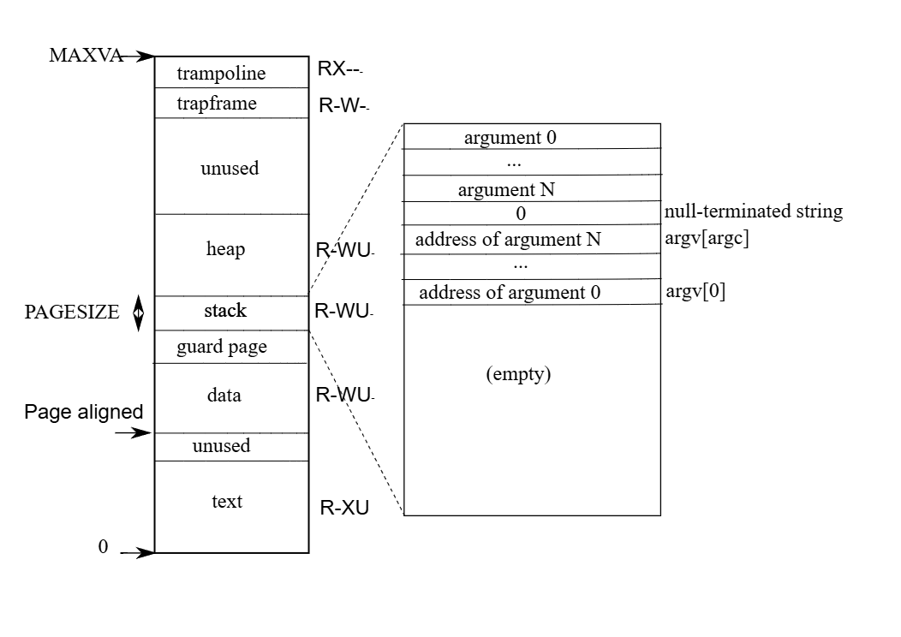

# Chapter 3：Page tables

頁表（Page Table）是作業系統用來為每個行程提供私有位址空間與記憶體的最常見的機制。 頁表決定了記憶體位址的含義，以及哪些物理記憶體區段可以被存取。 它們讓 xv6 能夠隔離不同行程的位址空間，並將它們多工使用在單一的物理記憶體上。 頁表之所以廣泛使用，是因為它們提供了一層間接性，使作業系統能夠進行許多「技巧」。 xv6 就使用了一些技巧：像是將相同的記憶體（例如 trampoline page）映射到多個位址空間中，並且用未映射的頁面來保護 kernel 與 user 的堆疊。 接下來的章節會說明 RISC-V 硬體所提供的頁表功能，以及 xv6 是如何使用這些功能的

## 3.1 Paging hardware

回顧一下，RISC-V 的指令（無論是使用者或核心）所操作的是虛擬位址。 機器的 RAM，也就是實體記憶體，則是以實體位址來索引。 RISC-V 的頁表硬體會將這兩種位址連接起來，將每個虛擬位址對應到一個實體位址來完成映射

xv6 運行在 Sv39 的 RISC-V 架構上，這代表 64 位元虛擬位址中，只有最低的 39 個位元會被使用，最上面的 25 個位元則不會被使用。 在 Sv39 的設定下，一個 RISC-V 頁表在邏輯上是一個包含 227（134,217,728）個 PTE 的陣列。 每個 PTE 包含一個 44 位元的實體頁面編號（PPN）以及一些旗標

分頁硬體會使用 39 位元中最高的 27 位元作為索引查找頁表，找到對應的 PTE，然後組合成一個 56 位元的實體位址：其最高 44 位元來自 PTE 裡的 PPN，最低 12 位元則複製自原本的虛擬位址。 圖 3.1 顯示了這個流程，使用一個簡化為 PTE 陣列的邏輯頁表來呈現（更完整的結構請參考圖 3.2）。 頁表讓作業系統可以以 4096（212）位元組對齊的區塊為單位，控制虛擬位址到實體位址的對應關係。 這種區塊就被稱作「頁面（page）」

在 Sv39 的 RISC-V 架構中，虛擬位址的最上面 25 個位元並不會參與轉換。 而在實體位址方面也預留了成長的空間：在 PTE 的格式中，實體頁面編號還可以再增加 10 個位元。 RISC-V 的設計者是根據技術的發展預測來選定這些數值的，239 位元組等於 512GB，對於在 RISC-V 電腦上運行的應用程式來說應該已經足夠。 256 則提供了足夠的實體記憶體空間，在可見的未來能容納許多 I/O 裝置與 RAM 模組。 如果未來還需要更多，RISC-V 的設計者也已定義了擁有 48 位元的虛擬位址空間的 Sv48[[1]](#1)

如圖 3.2 所示，RISC-V 的 CPU 會透過三個步驟將虛擬位址轉換為實體位址。 頁表在實體記憶體中會以三層的樹的形式儲存，這棵樹的根是一個 4096 位元組（一頁）的頁表，裡面包含 512 個 PTE，這些 PTE 內也各都儲存著下一層頁表的實體位址（其也是用一頁來儲存）。 而該頁表中的每個 PTE 所指向的頁表，其內會包含 512 個最底層的 PTE

分頁硬體會使用 27 位元中的最上面 9 位來在根頁表頁中選取一個 PTE，中間的 9 位元用來在下一層的頁表頁中選取一個 PTE，而最底下的 9 位元則用來選擇最終的 PTE（在 Sv48 的 RISC-V 中，頁表有四層，虛擬位址中的第 39 到 47 位會用來索引最頂層的頁表）

如果在位址轉換過程中所需的三個 PTE 中有任何一個不存在，分頁硬體就會產生一個「page-fault 例外」，並交由核心來處理這個例外（詳見第四章）

相較於圖 3.1 的單層設計，圖 3.2 所示的三層結構提供了一種更節省記憶體的方式來記錄 PTE。 在許多虛擬位址範圍根本沒有被對應的情況下，三層結構能夠直接省略整個頁表。 例如，如果一個應用程式只使用從位址 0 開始的幾個頁面，那麼第一層頁表內的第 1 到 511 的項目都會是無效的，核心不必耗費頁面來存這 511 個第二層頁表，也不需要分配這 511 個第二層頁表所對應到的底層頁表。 因此，在這個例子中，三層結構可以節省 511 頁的第二層頁表，以及 511×512 頁的底層頁表

雖然 CPU 會在執行 `load` 或 `store` 指令時，由硬體自動遍歷三層結構，但三層結構有個潛在缺點是：CPU 必須從記憶體中載入三個 PTE 才能完成虛擬位址到實體位址的轉換。 為了避免從實體記憶體載入 PTE 的開銷，RISC-V 的 CPU 會將 PTE 快取在一個稱為 Translation Look-aside Buffer（TLB）的結構中

每個 PTE 都包含一些旗標位元，用來告訴分頁硬體這個對應的虛擬位址允許被如何使用。 `PTE_V` 表示這個 PTE 是否存在：如果其沒被設置，則對該頁面的存取會引發例外。 `PTE_R` 決定指令能否讀取該頁。 `PTE_W` 決定能否寫入該頁。 `PTE_X` 決定 CPU 是否可以將該頁內容作為指令來執行。 `PTE_U` 決定user mode 下的指令是否可以存取該頁； 如果沒設置 `PTE_U`，則僅能在 supervisor mode 中使用該 PTE。 圖 3.2 展示了這整個是如何運作的。 這些旗標以及其他與頁面硬體有關的結構都定義在 [kernel/riscv.h](https://github.com/mit-pdos/xv6-riscv/blob/riscv//kernel/riscv.h) 中

若要讓 CPU 使用某個頁表，核心必須將根頁表的頁面的實體位址寫入 `satp` 暫存器中，這樣接下來 CPU 執行的所有指令所產生的位址，都會使用 `satp` 指向的頁表來進行轉換。 每顆 CPU 都有自己的 `satp` 暫存器，因此不同的 CPU 可以同時執行不同的行程，各自使用其私有的位址空間與頁表。 從核心的角度來看，頁表就是儲存在記憶體中的資料結構，核心會使用類似操作其他樹狀資料結構的方式來建立與修改頁表

這裡對書中所使用的一些術語做個簡要說明。 「實體記憶體」是指 RAM 中的儲存單元。 一個實體記憶體位元組會有一個稱為「實體位址」的位址。 那些會解參考位址的指令（例如 `load`、`store`、`jump`、function call）只會使用虛擬位址，這些虛擬位址會先由分頁硬體轉換為實體位址，再送到 RAM 進行讀寫

「位址空間」是指在某個頁表中有效的虛擬位址集合； xv6 中的每個行程都有自己的使用者位址空間，xv6 核心本身也有自己的位址空間。 「使用者記憶體」是行程的使用者位址空間加上頁表允許該行程存取的實體記憶體。 「虛擬記憶體」是一組與頁表管理有關的概念與技術，並透過它們來實現如隔離等目標

## 3.2 Kernel address space

Xv6 為每個行程維護一個頁表，用來描述該行程的使用者位址空間，此外還有一份單獨、全域的頁表描述核心的位址空間。 核心會配置自己位址空間的佈局（layout），使其能夠在預期的虛擬位址上存取實體記憶體與各種硬體資源。 圖 3.3 顯示這個佈局如何將核心虛擬位址對應到實體位址。 [kernel/memlayout.h](https://github.com/mit-pdos/xv6-riscv/blob/riscv//kernel/memlayout.h) 中宣告了 xv6 核心記憶體佈局的各種常數

QEMU 模擬了一台電腦，其中的 RAM（實體記憶體）從實體位址 `0x80000000` 開始，持續到 `0x88000000` 以上，這段範圍在 xv6 中稱為 `PHYSTOP`。 QEMU 的模擬也包含像是磁碟介面這樣的 I/O 裝置，QEMU 以記憶體映射控制暫存器（memory-mapped control registers）的方式，將這些裝置的介面暴露給軟體，這些暫存器位於實體位址空間中小於 `0x80000000` 的位置。 核心可以透過讀寫這些特殊的實體位址與裝置互動，換句話說這些讀寫會與裝置硬體溝通，而非與 RAM 互動。 第四章會解釋 xv6 是如何與裝置互動的

核心透過「直接映射」（direct mapping）的方式來存取 RAM 與 memory-mapped 的裝置暫存器，其會將資源映射到與其實體位址相同的虛擬位址上（VA == PA），例如核心本身在虛擬位址空間與實體記憶體中都位於 `KERNBASE=0x80000000`。 直接映射能簡化核心對實體記憶體的讀寫程式碼，例如在 `fork` 配置子行程的使用者記憶體時，配置器會回傳那塊記憶體的實體位址； `fork` 在複製父行程的使用者記憶體到子行程時，會直接把這個實體位址當作虛擬位址使用

有一些核心的虛擬位址並不是直接映射的：

- Trampoline 頁面：  
  它被映射到虛擬位址空間的最頂部，而使用者的頁表也會有這個相同的映射。 第四章會討論 trampoline 頁面的用途，但在這裡我們可以看到一個有趣的頁表用法：一個實體頁面（存放 trampoline 程式碼）在核心的虛擬位址空間中被映射了兩次，一次在虛擬空間頂部，另一次則為直接映射
- 核心堆疊頁面：  
  每個行程都有自己的核心堆疊，它會被映射到較高的虛擬位址位置，而 xv6 會在其下方留下一個沒有被映射的「保護頁面（guard page）」。 這個保護頁面的 PTE 是無效的（也就是 `PTE_V` 沒有設置），這樣當核心堆疊溢出時，通常就會觸發例外並使核心發生 panic。 若沒有保護頁面，堆疊溢出就可能會覆蓋其他核心記憶體，導致錯誤行為，而比起默默地發生錯誤執行，有出錯、崩潰是比較可以接受的

雖然核心透過高位址的映射使用它的堆疊，但核心其實也可以透過直接映射的位址存取這些堆疊。 另一種設計可能會只使用直接映射的方式，直接在那個位址操作堆疊。 不過在這種設計中，如果要提供保護頁面，就得取消某些本來會對應到實體記憶體的虛擬位址，這會讓記憶體變得難以使用

核心將 trampoline 頁面與核心程式碼頁面設置為具有 `PTE_R` 與 `PTE_X` 的權限，這表示核心可以在這些頁面上讀取並執行指令。 其他頁面則被設置為具有 `PTE_R` 與 `PTE_W` 的權限，以便核心能夠對這些頁面進行讀寫。 至於保護頁面，則被設為無效映射

## 3.3 Code: creating an address space

xv6 中大多數負責操作位址空間與頁表的程式碼都寫在 vm.c（[kernel/vm.c:1](https://github.com/mit-pdos/xv6-riscv/blob/riscv//kernel/vm.c#L1)）中。 主要的資料結構是 `pagetable_t`，它實際上是一個指向 RISC-V 根頁表的頁面的指標。 `pagetable_t` 的實例可能是核心的頁表，也可能是某個行程的頁表。 相關的主要函式有 `walk`，它用來找出某個虛擬位址對應的 PTE，以及 `mappages`，它會為新的映射關係建立對應的 PTE

以 `kvm` 開頭的函式會操作核心的頁表； 以 `uvm` 開頭的函式會操作使用者的頁表； 其他函式則可能同時用於兩者。 `copyout` 與 `copyin` 用來從系統呼叫的參數提供的使用者虛擬位址中複製資料進出，這兩個函式之所以寫在 vm.c 裡，是因為它們必須顯式地將虛擬位址轉換成對應的物理位址

在開機流程的早期，`main` 會呼叫 `kvminit`，透過 `kvmmake` 建立核心的頁表。 這個呼叫發生在 xv6 尚未啟用 RISC-V 的分頁功能之前，因此當時的位址仍直接對應到實體記憶體。 `kvmmake` 會先分配一頁實體記憶體作為根頁表的頁面，接著呼叫 `kvmmap` 來設置核心所需的映射關係。 這些映射包含了核心的程式與資料、本機到 `PHYSTOP` 為止的實體記憶體，以及實際上是裝置的某些記憶體區段。 `proc_mapstacks` 為每個行程配置一個核心堆疊，它會呼叫 `kvmmap`，把每個堆疊映射到由 `KSTACK` 產生的虛擬位址，同時為無效的保護頁面預留空間

`kvmmap`（[kernel/vm.c:132](https://github.com/mit-pdos/xv6-riscv/blob/riscv//kernel/vm.c#L132)）會呼叫 `mappages`（[kernel/vm.c:144](https://github.com/mit-pdos/xv6-riscv/blob/riscv//kernel/vm.c#L144)），針對目標範圍內的每個虛擬位址，以頁面大小為間格，將其映射關係加入到頁表中。 對於每個要映射的虛擬位址，`mappages` 會呼叫 `walk` 找到該位址對應的 PTE 位址，然後初始化這個 PTE，填入對應的實體頁號、所需的存取權限（例如 `PTE_W`、`PTE_X` 或 `PTE_R`），並設置 `PTE_V` 將該 PTE 標記為有效頁面

`walk`（[kernel/vm.c:86](https://github.com/mit-pdos/xv6-riscv/blob/riscv//kernel/vm.c#L86)）模擬 RISC-V 分頁硬體的行為，用來查找某個虛擬位址對應的 PTE。 `walk` 一次會往下走訪一層頁表，並使用該層虛擬位址的 9 個位元來索引對應的頁表。 在每一層頁表當中，它可能會找到下一層頁表的 PTE，或者是最終頁面的 PTE（[kernel/vm.c:92](https://github.com/mit-pdos/xv6-riscv/blob/riscv//kernel/vm.c#L92)）。 如果第一層或第二層的頁表中的 PTE 無效，表示該層的頁面尚未配置； 如果設置了 `alloc` 參數，`walk` 就會為新頁表配置一個新的頁面，並把它的實體位址寫入該 PTE。 最終 `walk` 會回傳樹中最底層那個 PTE 的位址（[kernel/vm.c:102](https://github.com/mit-pdos/xv6-riscv/blob/riscv//kernel/vm.c#L102)）

上述的程式碼只能在實體記憶體已被直接映射到核心的虛擬位址空間內的情況下執行。 例如，當 `walk` 向下走訪頁表時，它會從某個 PTE 中取得下一層頁表的實體位址（[kernel/vm.c:94](https://github.com/mit-pdos/xv6-riscv/blob/riscv//kernel/vm.c#L94)），然後把這個位址當作虛擬位址使用，來存取下一層的 PTE（[kernel/vm.c:92](https://github.com/mit-pdos/xv6-riscv/blob/riscv//kernel/vm.c#L92)）

`main` 會呼叫 `kvminithart`（[kernel/vm.c:62](https://github.com/mit-pdos/xv6-riscv/blob/riscv//kernel/vm.c#L62)）來載入核心的頁表，這個函式會將根頁表的頁面的實體位址寫入暫存器 `satp`，之後CPU 就會開始使用這份核心的頁表來進行位址轉譯。 由於核心使用的是直接映射，接下來的指令所使用的虛擬位址將會正確地映射到對應的實體記憶體位址上

每顆 RISC-V CPU 都會將 PTE 快取在 TLB（Translation Look-aside Buffer）中，而當 xv6 修改頁表時，它必須通知 CPU 將對應的 TLB 快取項目作廢。 否則之後 TLB 可能會使用到過時的快取映射，進而指向一個已經被分配給其他行程的實體頁面，導致某個行程不小心寫入其他行程的記憶體。 RISC-V 提供一條名為 `sfence.vma` 的指令，用於清空當前 CPU 的 TLB。 xv6 會在 `kvminithart` 中重新載入 `satp` 後執行 `sfence.vma`，或在切換至使用者頁表的 trampoline 程式碼中，於返回使用者空間之前執行 `sfence.vma`

在更改 `satp` 之前也必須執行一次 `sfence.vma`，以等待所有的 load 與 store 操作完成，這能確保先前對頁表的更新已完成，並且也能保證先前的 load 與 store 操作會使用舊的頁表，而不是新的頁表

::: tip  
`sfence.vma` 不只是用來清除 TLB，也可以作為一種記憶體屏障（memory barrier），確保舊頁表的操作完成後，才開始使用新頁表，以避免順序錯亂造成的錯誤  
:::

為了避免整個 TLB 被清空，RISC-V CPU 可能會支援 ASID[[1]](#1)。 這樣核心就可以只清除屬於特定地址空間的 TLB 項目。 但 xv6 並未使用這項功能

## 3.4 Physical memory allocation

核心在執行期間必須為頁表、使用者記憶體、核心堆疊，以及管道（pipe）緩衝區分配與釋放實體記憶體。 xv6 使用從核心結束位址到 `PHYSTOP` 之間的實體記憶體區域作為執行期間的配置來源，每次以 4096 位元組為單位配置與釋放整個頁面。 它透過將這些頁面本身串成一個 linked list 來追蹤空閒頁面，配置時會從 list 中取出一頁，而釋放時則是將該頁加入串列中

## 3.5 Code: Physical memory allocator

記憶體配置器實作於 kalloc.c（[kernel/kalloc.c:1](https://github.com/mit-pdos/xv6-riscv/blob/riscv//kernel/kalloc.c#L1)）中。 這個配置器是一個可分配的實體記憶體頁面所組成的「空閒串列（free list）」，串列的元素為 `struct run`，對應到一個空閒頁面

因為這些空閒頁面內並沒存其他東西，因此配置器會把每個空閒頁面對應的 `run` 結構直接存在該頁面裡面，使配置器之後能夠取得這個空閒串列的記憶體。 這個空閒串列還受到一個自旋鎖的保護（[kernel/kalloc.c:21-24](https://github.com/mit-pdos/xv6-riscv/blob/riscv//kernel/kalloc.c#L21-L24)），它們會一起被包在一個結構體裡，以明確表示該鎖保護的是此結構體內的欄位。 目前可以先忽略鎖以及 `acquire` 和 `release` 的呼叫，第六章會詳細討論 locking

`main` 函式會呼叫 `kinit` 來初始化配置器（[kernel/kalloc.c:27](https://github.com/mit-pdos/xv6-riscv/blob/riscv//kernel/kalloc.c#L27)），其會將空閒串列初始化為包含「從核心結尾到 `PHYSTOP`之間」的所有頁面。 理論上 xv6 應該要透過解析硬體所提供的設定資訊來判斷可用的實體記憶體大小，但 xv6 採取了簡化的做法：直接假設機器擁有 128MB 的記憶體。 `kinit` 會呼叫 `freerange`，並對每一頁都呼叫 `kfree`，以將記憶體加入空閒串列

由於 PTE 只能對齊到 4096 位元組（即 4096 的倍數）的實體位址，因此 `freerange` 使用 `PGROUNDUP` 來確保只會釋放有對齊的實體位址。 配置器一開始沒有任何可用的記憶體，這些 `kfree` 的呼叫則為它提供了可以管理的記憶體

配置器有時會將位址當作整數使用，以便對它們進行數學運算（例如在 `freerange` 中走訪所有頁面），有時又會將位址當作指標使用，用來讀寫記憶體（例如操作儲存在各頁面中的 `run` 結構）； 這種「位址的雙重用途」是配置器的實作中充滿 C type cast 的主要原因

`kfree` 函式會先將要釋放的記憶體中的每個位元組都設為數值 1。 這樣一來，若有程式在釋放後仍使用該記憶體（也就是所謂的「懸空參考（dangling reference）」），它讀取到的也會是雜訊資料而不是原本的正確內容，理論上可以更快地暴露錯誤。 接下來，`kfree` 會將該頁面加入空閒串列的前端：它將實體位址（`pa`）轉型為指向 `struct run` 的指標，將原本空閒串列的開頭記錄在 `r->next`，然後再將空閒串列的開頭設為 `r`。 而 `kalloc` 則會從空閒串列中取出（removes）並回傳第一個元素

## 3.6 Process address space

每個行程都有自己的頁表，而當 xv6 在行程間切換時，也會隨之切換頁表。 圖 3.4 比圖 2.3 更詳細地展示了一個行程的位址空間。 行程的使用者記憶體從虛擬位址 0 開始，可以一直成長到 `MAXVA`（[kernel/riscv.h:379](https://github.com/mit-pdos/xv6-riscv/blob/riscv//kernel/riscv.h#L379)），這使得一個行程理論上能夠存取高達 256 GB 的記憶體

一個行程的位址空間由多個頁面組成，這些頁面包括：儲存程式碼的頁面（xv6 為其設定的權限為 `PTE_R`、`PTE_X` 和 `PTE_U`）、包含預先初始化資料的頁面、一個用作 stack 的頁面，以及數個用作 heap 的頁面。 xv6 為資料、stack 與 heap 對應的頁面所設定的權限為 `PTE_R`、`PTE_W` 和 `PTE_U`

在使用者位址空間中設定權限，是強化使用者行程安全性的一種常見技巧。 如果 text 段映射為具有 `PTE_W` 權限的頁面，那麼行程就可能會不小心修改到自己的程式碼； 例如，若有程式錯誤導致對空指標寫入，就可能會改寫位於位址 0 的指令，接著程式繼續執行，造成更嚴重的後果。 為了立即偵測這類錯誤，xv6 在映射 text 段時不會給予 `PTE_W` 權限，因此如果程式誤寫入位址 0，硬體將會拒絕這次寫入並產生頁面錯誤，接著核心會終止該行程並輸出一條錯誤訊息，幫助開發者追蹤問題

同樣地，透過不為 data 段映射到的頁面設置 `PTE_X` 權限，使用者程式便無法意外跳躍到 data 段的位址，並從那裡開始執行

在現實世界中，透過精確地設定權限來強化行程的安全性，也有助於防禦各種安全攻擊。 攻擊者可能會為某些程式（例如一個網頁伺服器）設計一些精巧的輸入，藉此觸發程式中的某個錯誤，並進一步將其變成可被利用的漏洞。 謹慎地設定權限，加上其他技術（例如隨機化使用者位址空間的配置），能有效增加此類攻擊的難度

stack 段僅佔用一個頁面，圖 3.4 中顯示的是由 `exec` 建立的初始內容。 命令列參數的字串，以及指向這些字串的指標陣列，會被放在堆疊的最頂部。 緊接著在它們之下，是一些讓程式可以從 `main` 開始執行的資料，就像是呼叫了 `main(argc, argv)` 一樣

為了偵測使用者堆疊溢出分配範圍的情況，透過清除頁面的 `PTE_U` 標誌，xv6 在堆疊下方放置了一個無法存取的「保護頁（guard page）」。 若使用者堆疊溢出並試圖使用堆疊下方的位址，因為該保護頁對使用者模式的程式是不可存取的，硬體將產生頁面錯誤例外。 現實中的作業系統也有可能會選擇在堆疊溢出時自動配置更多記憶體

當某個行程向 xv6 索要更多使用者記憶體時，xv6 會擴展該行程的 heap 段。 首先會使用 `kalloc` 配置實體頁面，然後在該行程的頁表中新增指向這些實體頁面的 PTE，並為這些 PTE 中設置 `PTE_W`、`PTE_R`、`PTE_U` 和 `PTE_V` 標誌。 大多數行程並不會使用整個使用者位址空間，對於未使用的 `PTE`，xv6 會清除其 `PTE_V` 

這裡我們看到了頁表運用的幾個典型範例。 首先，不同行程的頁表會將使用者位址映射到不同的實體記憶體頁面，因此每個行程擁有各自私有的使用者記憶體。 其次，每個行程都會看到自己的記憶體是個從 0 開始且連續排列的虛擬位址空間，而實體記憶體則可以是不連續的。 第三，核心會在使用者位址空間頂端映射一個包含 trampoline 程式碼的頁面（不設置 `PTE_U`），因此這個單一實體頁面會出現在所有行程的位址空間中，但只有核心可以使用它

## Bibliography

- <a id="1">[1]</a>：The RISC-V instruction set manual Volume II: privileged specification. https://drive.google.com/file/d/1uviu1nH-tScFfgrovvFCrj7Omv8tFtkp/view?usp=drive_link, 2024
