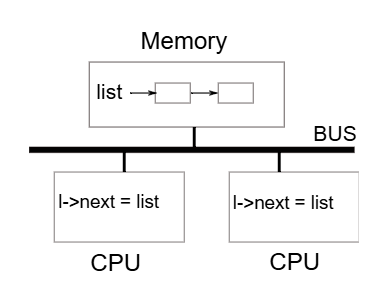
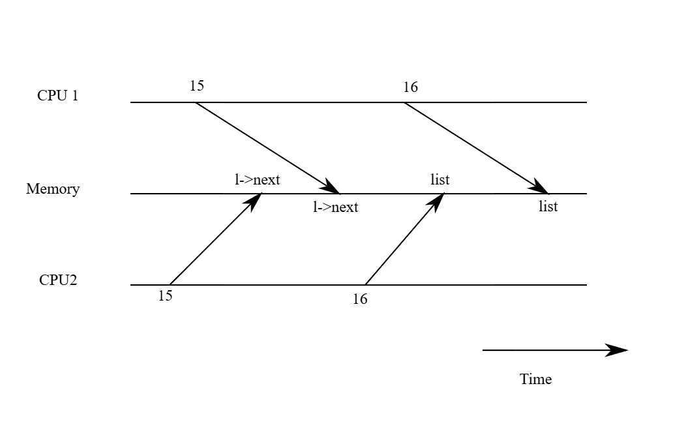

# xv6 riscv book chapter 6：Locking

包括 xv6 的大多數 kernel，在執行時都會交錯進行多個活動。 造成交錯的其中一個原因是多核的硬體：例如 xv6 的 RISC-V 支援多個獨立執行的 CPU。 這些 CPU 會共用實體 RAM，而 xv6 會善用這樣的特性來維護那些所有 CPU 都會讀寫的資料結構。 這種共用會產生一個問題，就是當某個 CPU 正在讀某個資料結構的同時，另一個 CPU 可能正好在修改它，甚至可能有多個 CPU 同時在修改同一筆資料

若沒有謹慎設計，這種平行存取很可能導致錯誤的結果，甚至破壞資料結構。 即便在單核心系統中，kernel 也可能在多個執行緒之間切換，使得它們的執行交錯進行。 最後，若某個裝置的 interrupt handler 與可被中斷的程式碼會修改同一份資料，而中斷剛好在不恰當的時機發生，則也可能會破壞資料。 並行（concurrency）這個詞就是指這種多條指令流因為多核平行處理、執行緒切換，或中斷而產生交錯的情況

kernel 中充滿了會被並行存取的資料。 舉例來說，兩個 CPU 可能會同時呼叫 `kalloc`，導致它們同時從 free list 的開頭取出項目。 kernel 的設計者傾向允許大量的並行，因為這樣可以透過平行運作提升效能，也能讓系統的反應更快。 但也因此，設計者必須在這樣的並行條件下，確保系統的正確性。 要寫出正確的程式碼有很多方法，也有一些較簡單的方法。 在並行情況下確保正確性的策略，以及支援這些策略的抽象機制，統稱為並行控制（concurrency control）技術

xv6 依據不同情況使用多種並行控制技術，而實際上還有更多其他可能的做法。 本章會聚焦在一種被廣泛使用的技術：鎖（lock）。 lock 提供互斥（mutual exclusion），確保每次只有一個 CPU 能持有這個鎖。 如果程式設計者為每個共享資料加上一把對應的鎖，並且在使用這份資料時總是持有這把鎖，那麼每次就只有一個 CPU 能使用這筆資料。 我們稱這種情況為「lock 保護了這筆資料」。 儘管 lock 是一種易於理解的並行控制機制，但它的缺點是可能會限制效能，因為它會讓原本可以並行的操作變成序列化的執行

本章接下來將說明 xv6 為何需要鎖、xv6 是如何實作鎖的，以及它是如何使用這些鎖的

## 6.1 Races

這邊用一個例子來說明為何我們需要鎖：假設有兩個 process，它們各自都有已結束（exited）的子行程，且這兩個 parent 在不同的 CPU 上呼叫了 `wait`。 由於 `wait` 會釋放子行程的記憶體，因此在每個 CPU 上，kernel 都會呼叫 `kfree` 來釋放這些子行程的記憶體 page

kernel 的記憶體分配器維護一個 linked list：`kalloc()` 會從 free list 中彈出一個 page，`kfree()` 則會把一個 page 推回 free list。 為了最佳效能，我們或許會希望這兩個 parent process 的 `kfree` 能同時並行執行，互不等待，但以 xv6 的 `kfree` 實作來說，這樣做是不正確的

圖 6.1 更詳細地說明了這個情境：free page 的 linked list 位於兩個 CPU 共享的記憶體中，而它們使用 load 與 store 指令來操作這個 list（實際上處理器內會有 cache，但概念上多處理器系統的行為就像是共享單一記憶體一樣）



如果沒有並行的請求，則 list 的 push 實作可能如下：

```c
struct element {
  int data;
  struct element *next;
};

struct element *list = 0;

void
push(int data)
{
  struct element *l;

  l = malloc(sizeof *l);
  l->data = data;
  l->next = list;
  list = l;
}
```

這段實作在單獨執行時是正確的，然而當多個實例同時執行時，這段程式就不正確了。 如果兩個 CPU 同時執行 `push`，那麼它們都可能如圖 6.1 所示地執行 `l->next = list`，這會導致在它們都還沒來得及執行 `list = l` 之前，就出現如圖 6.2 所示的錯誤結果：兩個 list 節點的 `next` 都指向原本的 list，而當這兩次 `list = l` 被執行時，第二次的賦值會覆蓋第一次的結果，導致第一次的節點遺失



在 `list = l` 發生的資料遺失就是一個競爭（race）的例子。 race 是指某個記憶體位置被多個執行緒或 CPU 同時存取，而且其至少有一個是寫入操作。 race 通常代表有 bug，要嘛是更新被遺失（如果是多次寫入），要嘛是讀到尚未完整更新的資料結構。 race 的結果會受到編譯器產生的機器碼、兩個 CPU 執行的時序，以及記憶體系統安排這些操作順序的方式影響，因此 race 導致的錯誤常常很難重現與除錯。 舉例來說，在 debug `push` 時加上 print statement 可能就改變了執行時序，使 race 的情況消失

避免 race 最常見的方法就是使用 lock。 lock 可以保證互斥（mutual exclusion），也就是在任一時間點，只有一個 CPU 能執行 `push` 中敏感的程式碼部分，這樣就能完全避免發生上述錯誤情況。 正確加上 lock 的版本只需要新增幾行：

```c
struct element *list = 0;
struct lock listlock;  // add this line

void
push(int data)
{
  struct element *l;
  l = malloc(sizeof *l);
  l->data = data;

  acquire(&listlock);  // add this line
  l->next = list;
  list = l;
  release(&listlock);  // add this line
}
```

在 `acquire` 與 `release` 之間的這段程式碼稱為臨界區（critical section）

我們通常說某個 lock 保護了某筆資料，這種時候實際上是指這個 lock 保護了一組描述這筆資料不變式（invariants），不變式是資料結構在不同操作之間需要維持的「性質」。 通常，一個操作是否正確，會仰賴於操作開始時那些不變式是否成立。 這個操作可能會在執行過程中暫時破壞這些不變式，但它必須在結束前再次恢復它們。 舉例來說，在 linked list 的例子中，不變式包括 `list` 應該指向串列的第一個節點，且每個節點的 `next` 欄位應該指向下一個節點

在 `push` 的實作中，這個不變式會被暫時打破：在 `l->next = list` 處，`l` 就已經指向了下一個節點，但此時 `list` 還沒指向 `l`（直到 `list = l` 才重新建立起來）。 前面我們討論的 race 發生的原因就是有另一個 CPU 在這些不變式暫時無效時執行了依賴於它們的操作。 正確使用 lock 可以確保任何時刻只有一個 CPU 可以在臨界區內操作資料結構，從而避免在不變式尚未成立的情況下執行錯誤的操作

你可以把 lock 想成是「序列化（serializing）」多個並行的臨界區，使它們一次只會有一個執行，從而保護那些不變式（前提是這些臨界區在單獨執行時本身就是正確的）。 你也可以這樣理解：由同一個 lock 保護的臨界區彼此之間具有「原子性」，也就是它們彼此之間只會看到其他臨界區完整執行後的結果，而永遠不會看到執行到一半的中間狀態

雖然 lock 對於確保正確性很有幫助，但它本質上會限制效能。 舉例來說，若兩個 process 同時呼叫 `kfree`，lock 會將這兩段臨界區序列化地執行，但這樣就無法透過使用不同 CPU 來得到效能上的好處了。 我們會說多個 process 在同時需要同一把 lock 時產生了衝突（conflict），或者說這把 lock 發生了競爭（contention）

kernel 設計中一大挑戰就是如何在追求平行化的同時避免 lock contention。 xv6 在這方面的設計比較少，但較進階的 kernel 則會特別針對資料結構與演算法設計來避免 contention。 以 list 為例，有些 kernel 會為每個 CPU 維護一個獨立的 free list，只有在當前 CPU 的 list 是空的情況下，才會去「偷取」別的 CPU 的記憶體。 其他應用場景則可能需要更複雜的設計

lock 的放置位置對效能也很重要。 舉例來說，雖然把 `push` 中的 `acquire` 移到更早的位置（例如放在 `l = malloc(sizeof *l)` 前）也是正確的作法，但這麼做可能會降低效能，因為這樣 `malloc` 的呼叫也會被序列化。 下面的「Using locks」小節會提供一些指引，說明該如何選擇 `acquire` 和 `release` 的插入位置

## 6.2 Code: Locks

xv6 有兩種類型的 lock：spinlock 和 sleep-lock。 我們先從 spinlock 開始介紹，xv6 用一個 `struct spinlock` 來表示一個 spinlock（[kernel/spinlock.h:2](https://github.com/mit-pdos/xv6-riscv/blob/riscv//kernel/spinlock.h#L2)）。 這個結構中最重要的欄位是 `locked`，當這個欄位為 0 表示 lock 是可用的，非零則表示 lock 已被持有。 從邏輯上來說，取得一把 lock 的實作可能長這樣：

```c
void
acquire(struct spinlock *lk) // does not work!
{
  for(;;) {
    if(lk->locked == 0) {
      lk->locked = 1;
      break;
    }
  }
}
```

不幸的是，這段實作在多核系統中無法保證互斥（mutual exclusion）。 可能會有兩個 CPU 同時執行到 `if(lk->locked == 0)` 這一行，且都發現 `lk->locked` 為 0，然後都執行 `assign` 將它設為 1，結果就是兩個不同的 CPU 都以為自己取得了這把 lock，這違反了互斥的基本原則。 因此我們需要一種能讓 lock 的判斷和 lock 的索取這兩行變成一個原子（不可分割）操作的方法

由於 lock 的使用非常普遍，多核處理器通常會提供某些指令，來實作判斷與索取 lock 的原子版本。 RISC-V 提供了 `amoswap r, a` 這條指令，其會讀取記憶體位址 `a` 的內容，然後將暫存器 `r` 的值寫入該位址，並把原先記憶體中的值存回 `r`。 換句話說，它會原子性地交換暫存器和記憶體位址的內容。這個過程是不可中斷的，硬體會確保在這個讀寫過程中沒有其他 CPU 介入存取這塊記憶體

xv6 的 `acquire`（[kernel/spinlock.c:22](https://github.com/mit-pdos/xv6-riscv/blob/riscv//kernel/spinlock.c#L22)）函式使用了一個可移植的 C 函式 `__sync_lock_test_and_set`，它的底層實作會轉換成 `amoswap` 指令； 這個函式會回傳 `lk->locked` 這個欄位的舊值（也就是 swap 前的值）。 `acquire` 會將這個 swap 操作包在一個迴圈裡，不斷重試（自旋），直到成功取得 lock 為止

每次迴圈都會嘗試將 1 寫入 `lk->locked`，並檢查它原本的值； 如果原本的值是 0，代表我們成功取得了 lock，且這次的 swap 會將 `lk->locked` 設為 1。 如果原本的值是 1，代表有其他 CPU 已經持有這把 lock，而這次我們雖然也執行了 swap，把 1 寫了進去，但其並沒有改變原來的值（都是 1）

為了除錯用途，當成功取得 lock 後，`acquire` 會紀錄是哪個 CPU 取得了這把 lock（`lk->cpu`）。 `lk->cpu` 這個欄位也會被該 lock（`lk`）保護，因此只能在持有該 lock 的情況下修改它

`release`（[kernel/spinlock.c:47](https://github.com/mit-pdos/xv6-riscv/blob/riscv//kernel/spinlock.c#L47)）函式與 `acquire` 相反：它會先清空 `lk->cpu` 欄位，然後釋放 lock。 從概念上來看，釋放 lock 只需要將 `lk->locked` 設為 0 就可以了。 但是 C 語言標準允許編譯器用多個 store 指令來實作單個 assignment，所以賦值操作在多執行緒的環境下可能不會是 atomic 的。 為了避免這個問題，`release` 使用了 C 標準庫中的 `__sync_lock_release` 函式，這個函式會做原子性的賦值以將 `lk->locked` 設為 0，它的底層也會轉換成 RISC-V 的 `amoswap` 指令
