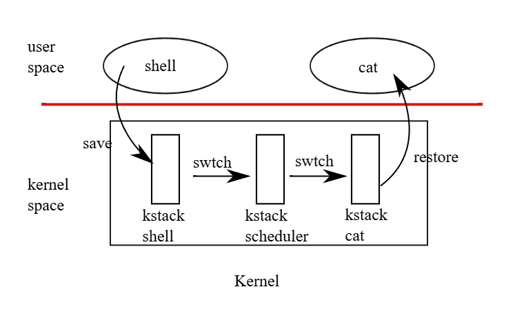

# xv6 riscv book chapter 7：Scheduling

任何作業系統在執行時，通常會有比電腦實際擁有的 CPU 數量還多的 process，因此必須有一套計劃來讓這些 process 能夠輪流使用 CPU。 理想上，這種共享機制對使用者的 process 來說應該要是透明的。 常見的做法是透過「multiplexing」的方式，把多個 process 映射（multiplex）到實際的硬體 CPU 上，讓每個 process 產生擁有自己虛擬 CPU 的錯覺。 本章會說明 xv6 是如何實現這樣的 multiplexing 的

## 7.1 Multiplexing

xv6 的 multiplexing 機制會在兩種情況下讓某個 CPU 從一個 process 切換到另一個。 第一種是當 process 呼叫會阻塞（也就是需要等待某些事件才能繼續）的 system call 時，例如 `read`、`wait` 或 `sleep`，此時會透過 xv6 的 `sleep` 與 `wakeup` 機制來切換； 第二種是為了應對那些長時間運算而不會阻塞的 process，xv6 會定期強制讓 CPU 切換到其他 process。 前者稱為「自願切換（voluntary switches）」，後者則稱為「非自願切換（involuntary switches）」。 透過這些切換，xv6 創造出每個 process 各自擁有一顆 CPU 的錯覺

要實作 multiplexing 有幾個挑戰：

- 第一，該如何從一個 process 切換到另一個？
  - 基本的作法是儲存與還原 CPU 的暫存器，不過因為這種行為無法用 C 來表達，所以會比較麻煩
- 第二，該如何讓「強制切換」對 user process 來說是透明的？
  - xv6 採用了一個標準技巧，由硬體 timer 所觸發的中斷來驅動 context switch
- 第三，由於所有 CPU 都會在同一組 process 間切換，因此必須設計一套鎖定策略以避免 race condition
- 第四，當一個 process 結束時，它的記憶體與其他資源必須被釋放，但 process 自己無法完成這些釋放動作
  - 例如 process 無法在其還在使用 kernel stack 的情況下釋放那塊 stack，需要其他 thread 幫它收尾
- 第五，對於多核機器，每顆 CPU 都必須記住自己目前正在執行哪個 process，這樣 system call 才能正確地作用在那個 process 的 kernel 狀態上
- 最後，`sleep` 和 `wakeup` 機制允許 process 放棄 CPU，並等待其他 process 或中斷將它喚醒，而這裡需要特別小心，避免 race condition 導致喚醒通知被遺失

## 7.2 Code: Context switching

圖 7.1 說明了從一個 user process 切換到另一個時所經歷的步驟：首先是從 user space 發出 trap（可能是 system call 或 interrupt），轉入舊 process 的 kernel thread； 接著切換到目前 CPU 的 scheduler thread； 然後切換到新 process 的 kernel thread； 最後從 trap return 回到新的 user-level process

xv6 為 scheduler 使用了獨立的 thread（各自擁有暫存器與 stack 的保存空間），因為讓 scheduler 在任意 process 的 kernel stack 上執行並不安全：其他 CPU 可能會在這段期間喚醒該 process 並開始執行，若兩個 CPU 共用同一個 stack，會造成災難性的後果。 為了處理多顆 CPU 同時執行、並有 process 要放棄 CPU 的情況，xv6 為每個 CPU 配置了獨立的 scheduler thread。 在這一節中，我們將會詳細探討 kernel thread 與 scheduler thread 之間切換的具體實作方式



從一個 thread 切換到另一個 thread 的過程，需要將舊 thread 的 CPU 暫存器儲存下來，並還原新 thread 先前儲存的那些暫存器。 由於 stack pointer 和 program counter 都會被儲存與還原，這也表示 CPU 將會切換至新的 stack，並且執行新的程式碼

`swtch` 函式負責儲存與還原暫存器，實作 kernel thread 間的切換。 `swtch` 並不直接知道所謂的「thread」是什麼，它只負責儲存與還原一組 RISC-V 的暫存器，這組暫存器的集合被稱作「context」。 當某個 process 要放棄 CPU 時，它的 kernel thread 會呼叫 `swtch`，把自己的 context 儲存起來，並還原 scheduler 的 context

每個 context 都存在 `struct context`（[kernel/proc.h:2](https://github.com/mit-pdos/xv6-riscv/blob/riscv//kernel/proc.h#L2)）裡，這個結構會被放在某個 process 的 `struct proc` 或某個 CPU 的 `struct cpu` 中。 `swtch` 會接收 `struct context *old` 和 `struct context *new` 這兩個引數，並將目前的暫存器儲存到 `old`，從 `new` 中載入先前儲存的暫存器，然後 return

現在讓我們來追蹤一個 process 如何透過 `swtch` 切換進入 `scheduler` 的。 在第四章中我們看到，中斷的結束階段中有一種情況是 `usertrap` 呼叫 `yield`。 而 `yield` 接著會呼叫 `sched`，`sched` 再呼叫 `swtch`，把目前的 context 存到 `p->context` 中，並切換到先前儲存在 `cpu->context` 的 scheduler context（[kernel/proc.c:506](https://github.com/mit-pdos/xv6-riscv/blob/riscv//kernel/proc.c#L506)）

`swtch`（[kernel/swtch.S:3](https://github.com/mit-pdos/xv6-riscv/blob/riscv//kernel/swtch.S#L3)）只會儲存 callee-saved 暫存器，而 caller-saved 暫存器則會由 C 編譯器在呼叫端負責儲存到 `stack` 上。 `swtch` 知道每個暫存器對應到 `struct context` 中的哪個成員，以及該成員的偏移量。 它不會儲存 program counter，而是儲存 `ra` 暫存器，這個暫存器中存放的是呼叫 `swtch` 那一行指令的 return address

接著，`swtch` 從新的 context 還原暫存器，這些值是先前某次 `swtch` 儲存的。 當 `swtch` 呼叫 `ret` 返回時，它會回到還原後的 `ra` 所指向的那行指令，也就是新 thread 先前呼叫 `swtch` 的那個位置。 同時，因為 `sp` 已被還原為新 thread 的 stack pointer，因此執行也會從新 thread 的 stack 上繼續

在我們這個例子中，`sched` 會呼叫 `swtch`，並切換到 `cpu->context`，也就是這顆 CPU 專屬的 scheduler context。 這份 context 是在先前某個時刻，由 scheduler 呼叫 `swtch` 並切換到現在這個 process 時所儲存的（[kernel/proc.c:466](https://github.com/mit-pdos/xv6-riscv/blob/riscv//kernel/proc.c#L466)）。 所以當我們目前追蹤的這次 `swtch` return 時，它實際上不是回到 `sched`，而是回到 scheduler，而且此時 stack pointer 已經是這顆 CPU 的 scheduler stack 了

::: tip  
根據 [RISC-V Calling Conventions](https://github.com/riscv-non-isa/riscv-elf-psabi-doc/blob/master/riscv-cc.adoc)，暫存器口語上會分成兩類：

- caller-saved registers：呼叫者在呼叫 function 前要自己備份，包含 `a0–a7`, `t0–t6`, `ra` 等
- callee-saved registers：被呼叫者（像 `swtch`）必須保存與還原，包含 `s0–s11`, `sp` 等

這可以在點進去一開始的表格中的「Preserved across calls?」欄位看到，為「Yes」的就是文中說的 callee-saved register。 而 `ra` 雖然不是 callee-saved register，但 `swtch` 為了做 context switch 所以有存

而 `swtch` 做的事基本上就是：

1. 把被換出的 process 的 context 存到 `struct context *old`
2. 把換進來要執行的 process 的 context 用 `struct context *new` 的內容復原
3. 利用 `ret` 回到 `new->ra` 處執行

而對於文中的例子，由於它是由 `sched` 去呼叫 `swtch`，所以 `new` 填的會是 `&mycpu()->context`，也就是一個 pre-CPU 的 scheduler context  
:::

## 7.3 Code: Scheduling

上一節我們探討了 `swtch` 的底層細節； 現在我們把來觀察 process 的 kernel thread 是如何透過 scheduler 切換到另一個 process 的。 scheduler 是每顆 CPU 上的一個特殊的 thread，這個 thread 執行的是 `scheduler` 函式。 這個函式會負責選出下一個要執行的 process。 當某個 process 想放棄 CPU 時，它必須先取得自己的 process lock `p->lock`，釋放它持有的其他 lock，更新自己的狀態（`p->state`），然後呼叫 `sched`。 你可以在 `yield`（[kernel/proc.c:512](https://github.com/mit-pdos/xv6-riscv/blob/riscv//kernel/proc.c#L512)）、`sleep` 和 `exit` 中看到這個流程

接著 `sched` 會再次確認這些條件是否已被滿足（[kernel/proc.c:496-501](https://github.com/mit-pdos/xv6-riscv/blob/riscv//kernel/proc.c#L496-L501)），並檢查一個隱含的條件：既然有持有鎖，則必須確保中斷已被關閉。 最後，`sched` 呼叫 `swtch`，將當前的 context 存入 `p->context`，並切換到 `cpu->context` 中的 scheduler context。 `swtch` 返回時會回到 scheduler 的 stack，就好像當初 scheduler 呼叫的 `swtch` 返回了一樣（[kernel/proc.c:466](https://github.com/mit-pdos/xv6-riscv/blob/riscv//kernel/proc.c#L466)）。 然後 scheduler 繼續它的 for 迴圈，找下一個 process 來執行，再切換過去，如此反覆循環

::: tip  
- `scheduler()` 是每顆 CPU 的主控 loop，會尋找 runnable process，並執行它
- 被執行的 process 如果想釋放 CPU（例如主動呼叫 `yield`、被 `sleep` 阻塞、或是 `exit`），就會開始切換流程
- 這時 `sched()` 函式會做兩件事：確認合法狀態、呼叫 `swtch` 並切回 scheduler

此處 `swtch` 不是隨便 return 的，而是會直接回到當初 `scheduler()` 呼叫 `swtch()` 的那一點，這依賴於之前 `scheduler()` 有正確地保存自己的 context  
:::

我們剛剛看到 xv6 在呼叫 `swtch` 的整個過程中會持續持有 `p->lock`：呼叫 `swtch` 的程式碼必須事先持有這把 lock，並且這把 lock 的控制權會一併傳給被切換過去的程式碼。 這樣的安排並不常見：更常見的做法是持有鎖的一方同時負責釋放它。 但 xv6 不能這樣做，因為 `p->lock` 保護了 `p->state` 與 `p->context` 欄位的狀態不變性，而這些不變性在執行 `swtch` 的時候會被暫時破壞掉

例如，如果在執行 `swtch` 期間沒有持有 `p->lock`，那麼另一顆 CPU 可能會在 `yield` 將 process 狀態設為 `RUNNABLE` 之後、但 `swtch` 還沒釋出 stack 之前，就搶先執行這個 process，導致兩個 CPU 同時在用同一個 stack，造成災難

因此，一旦 `yield` 開始修改 process 的狀態，使它變成 `RUNNABLE`，那就必須持續持有 `p->lock`，直到系統恢復狀態一致為止：最早能釋放 lock 的時間點是在 scheduler（它使用自己的 stack 執行）清除 `c->proc` 之後。 反過來說，當 scheduler 開始把某個 `RUNNABLE` process 轉換成 `RUNNING` 時，也不能在 `swtch` 之前釋放 lock，而是要等到 process 的 kernel thread 真正開始執行（例如在 `yield` 裡）之後才行

kernel thread 唯一會放棄 CPU 的地方是在 `sched`，而它總會切換回 scheduler 中的同一段位置，然後 scheduler 幾乎又總會切換到某個先前呼叫過 `sched` 的 kernel thread。 因此，如果你列印出 xv6 切換執行緒所在的行號，你會看到一個很簡單的模式：466、506、466、506，這樣反覆。 這種透過 thread switch 有意地把控制權交給彼此的程式，有時被稱作 coroutines； 在這個例子中，`sched` 和 `scheduler` 就是彼此的 coroutine

::: tip  
假設 CPU 0 上的 process A 呼叫了 `yeild` 放棄 CPU，此時在 `yeild` 內會將 `p->lock` 上鎖，將 `p->state` 改成 `RUNNABLE`，然後呼叫 `sched`：

```c
// Give up the CPU for one scheduling round.
void
yield(void)
{
  struct proc *p = myproc();
  acquire(&p->lock);
  p->state = RUNNABLE;
  sched();
  release(&p->lock);
}
```

接著 `sched` 會呼叫 `swtch`：

```c
// Switch to scheduler.  Must hold only p->lock
// and have changed proc->state. Saves and restores
// intena because intena is a property of this
// kernel thread, not this CPU. It should
// be proc->intena and proc->noff, but that would
// break in the few places where a lock is held but
// there's no process.
void
sched(void)
{
  int intena;
  struct proc *p = myproc();

  if(!holding(&p->lock))
    panic("sched p->lock");
  if(mycpu()->noff != 1)
    panic("sched locks");
  if(p->state == RUNNING)
    panic("sched RUNNING");
  if(intr_get())
    panic("sched interruptible");

  intena = mycpu()->intena;
  swtch(&p->context, &mycpu()->context);
  mycpu()->intena = intena;
}
```

而如前面所述，`swtch` 本身只做 context 的儲存與還原，然後 return，這裡 `ret` 會回到 scheduler context：

```asm
swtch:
        sd ra, 0(a0)
        sd sp, 8(a0)
        sd s0, 16(a0)
        sd s1, 24(a0)
        sd s2, 32(a0)
        sd s3, 40(a0)
        sd s4, 48(a0)
        sd s5, 56(a0)
        sd s6, 64(a0)
        sd s7, 72(a0)
        sd s8, 80(a0)
        sd s9, 88(a0)
        sd s10, 96(a0)
        sd s11, 104(a0)

        ld ra, 0(a1)
        ld sp, 8(a1)
        ld s0, 16(a1)
        ld s1, 24(a1)
        ld s2, 32(a1)
        ld s3, 40(a1)
        ld s4, 48(a1)
        ld s5, 56(a1)
        ld s6, 64(a1)
        ld s7, 72(a1)
        ld s8, 80(a1)
        ld s9, 88(a1)
        ld s10, 96(a1)
        ld s11, 104(a1)
        
        ret
```

但在執行 `swtch` 的期間，context 還沒搬完，到目前整個流程都還跟一般的 function call 一樣，所以 CPU 0 還處在 process A 的 stack 上。 此時如果 CPU 1 正在執行 `scheduler`，看到 process A 的 `p->state` 為 `RUNNABLE`，就有可能嘗試呼叫 `acquire(p->lock)` 並把它抓進去執行，成功的話兩個 CPU 就會同時執行 process A 且共用了它的 stack，因此才要上鎖，讓 `acquire(p->lock)` 失敗

下面為 `scheduler` 的實作：

```c
// Per-CPU process scheduler.
// Each CPU calls scheduler() after setting itself up.
// Scheduler never returns.  It loops, doing:
//  - choose a process to run.
//  - swtch to start running that process.
//  - eventually that process transfers control
//    via swtch back to the scheduler.
void
scheduler(void)
{
  struct proc *p;
  struct cpu *c = mycpu();

  c->proc = 0;
  for(;;){
    // The most recent process to run may have had interrupts
    // turned off; enable them to avoid a deadlock if all
    // processes are waiting. Then turn them back off
    // to avoid a possible race between an interrupt
    // and wfi.
    intr_on();
    intr_off();

    int found = 0;
    for(p = proc; p < &proc[NPROC]; p++) {
      acquire(&p->lock);
      if(p->state == RUNNABLE) {
        // Switch to chosen process.  It is the process's job
        // to release its lock and then reacquire it
        // before jumping back to us.
        p->state = RUNNING;
        c->proc = p;
        swtch(&c->context, &p->context);

        // Process is done running for now.
        // It should have changed its p->state before coming back.
        c->proc = 0;
        found = 1;
      }
      release(&p->lock);
    }
    if(found == 0) {
      // nothing to run; stop running on this core until an interrupt.
      asm volatile("wfi");
    }
  }
}
```

可以看到在內層的 for loop 中會先呼叫 `acquire`，然後才會確認 `p->state` 是不是 `RUNNABLE` 的。 這邊雖然會依序對 process array 中的每個 process 做 `acquire`，但這其實並沒有關係，不會有卡住的問題，因為大部分的時候 `p->lock` 是空閒的，process 在 user space 跑的時候不會上鎖，只有在向上面 `swtch` 這種期間才會持鎖  

再來你會看到 `yield` 裡面在 `sched` 之後還呼叫了 `release(&p->lock)`，而其對應的 `sched` 內，在 `swtch(&p->context, &mycpu()->context)` 之後做了 `mycpu()->intena = intena;` 這件事

這是因為當 process A 被換出 CPU 0 時，其儲存的位置是在 `swtch(&p->context, &mycpu()->context)` 這行，因此之後 process A 被換回來的時候，它會依序再由原路徑返回，下面是一個示意用的流程（我畫好久）：

```lua
Process A
├─ ...
└─ yield()
   ├─ acquire(A.lock)                                            ← A 上鎖
   ├─ A.state = RUNNABLE
   └─ sched()
      └─ swtch(&p->context, &cpu->scheduler)                     ← 鎖仍在 A 手上
          └─► 進入 scheduler()  (CPU 專屬 stack)
              ├─ c->proc = 0;
              ├─ found = 1;
              ├─ release(A.lock)                                 ← 第一次釋放 A 的鎖
              ├─ for 迴圈掃表，找到 Process B
              ├─ acquire(B.lock)
              ├─ B.state = RUNNING
              └─ swtch(&cpu->scheduler, &B.context)
                  └─► 進入 Process B（執行一段時間…）
                      … B 透過 yield()/sleep() 等放棄 CPU …
                  ◄─ 回到 scheduler()
                      ├─ c->proc = 0
                      ├─ found = 1;
                      ├─ release(B.lock)
                      ├─ 找到 Process A (再次 acquire(A.lock))    ← A 再度上鎖
                      ├─ p->state = RUNNING
                      └─ swtch(&cpu->scheduler, &p->context)
                          └─► 回到 Process A 的 sched()

      ◄─ 回到 sched()         (A 的 kernel stack)
         ├─ mycpu()->intena = intena
         └─ return 回到 yield()

   ◄─ yield() 尾端
      └─ release(A.lock)                                         ← 第二次釋放 A 的鎖
```  
:::

有一種情況下，scheduler 呼叫 `swtch` 後不會進入 `sched`。 `allocproc` 會把新 process 的 context 中的 `ra` 設為 `forkret`（[kernel/proc.c:524](https://github.com/mit-pdos/xv6-riscv/blob/riscv//kernel/proc.c#L524)），這樣這個 process 第一次被切入時，`swtch` 就會「return」到那個函式的開頭。 `forkret` 的存在是為了釋放 `p->lock`； 否則，因為這個新 process 需要回到 user space（就像從 fork return 一樣），它本來可以直接從 `usertrapret` 開始執行

::: tip  
這是 fork 新 process 的特殊處理：

- 新 process 還沒有執行過，所以它沒有先前的 `swtch` return 點
- `allocproc` 人為設一個 `context.ra = forkret`，讓第一次執行時 `swtch` 能跳進去
- `forkret` 的任務是先完成 kernel 端的收尾（例如釋放鎖），然後才進入 `usertrapret`，跳回 user space

這樣做可讓新建 process 也能使用與其他 process 相同的切換邏輯  
:::

`scheduler`（[kernel/proc.c:445](https://github.com/mit-pdos/xv6-riscv/blob/riscv//kernel/proc.c#L445)）會跑一個無限迴圈：找出一個可執行的 process，執行它直到它釋放 CPU，再重複這個流程。 scheduler 會遍歷整個 process table，尋找狀態為 `RUNNABLE` 的 process。 一旦找到，它會設置這顆 CPU 的 `c->proc` 指標，將該 process 的狀態設為 `RUNNING`，然後呼叫 `swtch` 開始執行它（[kernel/proc.c:461-466](https://github.com/mit-pdos/xv6-riscv/blob/riscv//kernel/proc.c#L461-L466)）

## 7.4 Code: mycpu and myproc

xv6 經常需要取得目前正在執行的 process 所對應的 `proc` 結構的指標。 在單核系統中，可以使用一個全域變數來指向當前的 `proc`。 但這在多核機器上就行不通了，因為每個 CPU 都可能在執行不同的 process。 我們可以透過「每顆 CPU 都擁有自己獨立的一組暫存器」這件事來解決這個問題

當某顆 CPU 正在執行 kernel code 時，xv6 保證這顆 CPU 的 `tp` 暫存器會儲存它的 hartid。 RISC-V 為每顆 CPU 指派了一個唯一的 hartid。 `mycpu` 函式（[kernel/proc.c:74](https://github.com/mit-pdos/xv6-riscv/blob/riscv//kernel/proc.c#L74)）會使用 `tp` 來索引 `struct cpu` 的陣列，並回傳指向目前這顆 CPU 的 `struct cpu` 的指標。 `struct cpu`（[kernel/proc.h:22](https://github.com/mit-pdos/xv6-riscv/blob/riscv//kernel/proc.h#L22)）中包含了一個指向當前正在這顆 CPU 上執行的 `struct proc` 的指標（若有的話）、這顆 CPU 所對應的 scheduler thread 的暫存器快照、以及用來管理中斷關閉的 spinlock 巢狀層數

要讓每顆 CPU 的 `tp` 保持對應的 hartid，其實需要一點額外處理，因為使用者程式是可以隨意修改 `tp` 的。 `start` 函式會在 CPU 的開機過程早期、仍處於 machine mode 時設置 `tp`（[kernel/start.c:45](https://github.com/mit-pdos/xv6-riscv/blob/riscv//kernel/start.c#L45)）。 `usertrapret` 會把 `tp` 儲存在 trampoline page 中，以防使用者程式改動了它。 最後，`uservec` 在從 user space 進入 kernel 時會還原之前儲存的 `tp`（[kernel/trampoline.S:78](https://github.com/mit-pdos/xv6-riscv/blob/riscv//kernel/trampoline.S#L78)）。 編譯器保證在 kernel code 中永遠不會去修改 `tp`。 如果 xv6 可以直接向 RISC-V 硬體查詢目前的 hartid 會更方便，但 RISC-V 規範中只有 machine mode 才能這麼做，supervisor mode 不行

`cpuid` 和 `mycpu` 的回傳值比較脆弱（fragile），如果在這之後發生 timer 中斷，導致目前這條 thread 放棄 CPU，然後稍後被排到另一顆 CPU 上執行，那麼原先回傳的值就會失效。 為了避免這個問題，xv6 要求呼叫這些函式的程式碼在使用期間必須先關閉中斷，等到使用完畢後再重新開啟

函式 `myproc`（[kernel/proc.c:83](https://github.com/mit-pdos/xv6-riscv/blob/riscv//kernel/proc.c#L83)）會回傳目前正在當前 CPU 上執行的 process 的 `struct proc` 指標。 `myproc` 在執行過程中會先關閉中斷，接著呼叫 `mycpu`，從 `struct cpu` 中取得目前的 `c->proc`，最後再重新開啟中斷。 `myproc` 的回傳值在中斷開啟的情況下也可以安全使用：即使 timer 中斷將目前的 process 移動到另一顆 CPU，指向這個 process 的 `struct proc` 指標仍然是同一個

## 7.5 Sleep and wakeup

排程與鎖有助於把一個執行緒的行為對其他執行緒隱藏起來，但我們也需要一些抽象工具來讓執行緒之間可以有意識地互動。 舉例來說，xv6 中 pipe 的讀取端可能需要等待寫入端產生資料； 父 process 呼叫 `wait` 時可能要等子 process 結束； 而一個讀硬碟的 process 則需要等待硬碟裝置完成資料讀取

xv6 kernel 在這些（以及其他許多）情境中會使用名為 sleep 與 wakeup 的機制。 sleep 讓 kernel 執行緒可以等待特定事件； 而另一個執行緒則可以呼叫 wakeup 來通知等待某個事件的執行緒可以繼續執行了。 sleep 和 wakeup 常被稱為「順序協調（sequence coordination）」或「條件同步（conditional synchronization）」機制

sleep 和 wakeup 提供的是一種相對底層的同步介面。 為了說明它們在 xv6 中的運作方式，我們將使用它們來構建一個較高層級的同步機制，稱為 semaphore（但 xv6 並未實際使用 semaphore）。 一個 semaphore 會維護一個計數器，並提供兩種操作：V 操作（由生產者使用）會將計數器加一； P 操作（由消費者使用）會等計數器變為非零值，然後將其減一並返回。 假設只有一個生產者執行緒與一個消費者執行緒，其分別在不同的 CPU 上執行，並且編譯器沒有做過度最佳化，那麼以下的實作將是正確的：

```c
struct semaphore {
  struct spinlock lock;
  int count;
};

void 
V(struct semaphore *s)
{
  acquire(&s->lock);
  s->count += 1;
  release(&s->lock);
}

void
P(struct semaphore *s)
{
  while(s->count == 0)
    ;
  acquire(&s->lock);
  s->count -= 1;
  release(&s->lock);
}
```

但上述的實作非常低效。 若生產者很少會被執行，消費者就會把大部分的時間花在 while 迴圈中自旋，等待 `count` 變成非零值。 消費者所佔用的 CPU 應該可以用來做更有生產力的事，而不是透過不斷輪詢 `s->count` 來忙等。 若要避免這種忙等，我們就需要讓消費者能夠讓出 CPU，等到 `V` 把 count 加一後才再回來繼續執行

儘管這樣還不夠完善，但這正是往前的第一步。 設想有一對名為 `sleep` 和 `wakeup` 的函式，其行為如下：`sleep(chan)` 會等待一個由 `chan` 的值所指定的事件，這個值被稱為「等待通道（wait channel）」。 `sleep` 會讓呼叫它的 process 進入睡眠狀態，並釋放 CPU 讓其他工作可以執行。 `wakeup(chan)` 則會喚醒所有正在對相同 `chan` 呼叫 `sleep` 的 process（如果有的話），讓那些 `sleep` 函式返回。 如果沒有 process 正在等待該 `chan`，則 `wakeup` 不會有任何效果

現在我們可以利用 `sleep` 與 `wakeup` 來修改 semaphore 的實作：

```c
void
V(struct semaphore *s)
{
   acquire(&s->lock);
   s->count += 1;
   wakeup(s);  // added line
   release(&s->lock);
}

void
P(struct semaphore *s)
{
  while(s->count == 0)
    sleep(s);   // added line
  acquire(&s->lock);
  s->count -= 1;
  release(&s->lock);
}
```

現在 `P` 不再自旋了，其會讓出 CPU，這是個好改進。 不過要用這種介面正確實作 sleep 和 wakeup 並不容易，因為我們會遇到一種稱為「喚醒遺失（lost wake-up）」的問題。 假設 `P` 在 `while(s->count == 0)` 處發現 `s->count == 0`，但就在 `P` 執行完第 13 行，準備執行第 14 行時，`V` 在另一個 CPU 上被執行了，此時 `V` 將 `s->count` 改為了非零值，並呼叫了 `wakeup`，但此時尚未有任何 process 在睡眠中，因此 `wakeup` 就沒有做任何事

接著 `P` 繼續執行到第 14 行，呼叫了 `sleep` 並進入了睡眠狀態。 這就造成了一個問題：`P` 此時正在等待一個已經由 `V` 發完的 `wakeup` 呼叫。 除非我們運氣很好，生產者再次呼叫了 `V`，否則消費者將會被永遠卡住，即使 `count` 已經是非零值了

這個問題的根源在於，一個重要的不變式被破壞了：`P` 只會在 `s->count == 0` 的時候才去 `sleep`。 但這個不變式在 `V` 剛好於錯誤時機執行時會被破壞。 有一種錯誤的解法，是試圖透過把 `P` 裡面取得 lock 的動作往前移，讓 `count` 的檢查與呼叫 `sleep` 的過程變成原子操作：

```c
void
V(struct semaphore *s)
{
  acquire(&s->lock);
  s->count += 1;
  wakeup(s);
  release(&s->lock);
}

void
P(struct semaphore *s)
{
  acquire(&s->lock);        // <--- 錯誤方式
  while(s->count == 0)
    sleep(s);
  s->count -= 1;
  release(&s->lock);
}
```

我們希望這個版本的 `P` 能避免 lost wakeup，因為 lock 阻止了 `V` 在 `while(s->count == 0)` 與 `sleep(s)` 之間插入執行。 它確實做到了這點，但也同時導致了死鎖：`P` 在進入 `sleep` 時仍持有 lock，導致 `V` 永遠無法取得 lock 而被卡住

我們將透過改變 `sleep` 的介面來修正先前的設計問題：呼叫者必須將「條件鎖（condition lock）」傳遞給 `sleep`，讓 `sleep` 可以在呼叫者被標記為睡眠，並在指定的 sleep channel 等待後釋放該鎖。 這把鎖會強制讓同時執行的 `V` 延後執行，直到 `P` 完成進入睡眠，這樣 `wakeup` 才能正確找到處於睡眠狀態的消費者並喚醒它。 一旦消費者再次被喚醒，`sleep` 會在返回前重新取得這把鎖。 經過這種修正後的 sleep/wakeup 機制可以如下列方式使用：

```c
void
V(struct semaphore *s)
{
  acquire(&s->lock);
  s->count += 1;
  wakeup(s);
  release(&s->lock);
}

void
P(struct semaphore *s)
{
  acquire(&s->lock);
  while(s->count == 0)
     sleep(s, &s->lock);  // <--- 改版後的 sleep 會接受一個 lock 引數
  s->count -= 1;
  release(&s->lock);
}
```

`P` 在進入 `sleep` 前就已經持有了 `s->lock`，這使得 `V` 無法在 `P` 檢查 `s->count` 和呼叫 `sleep` 之間插入並嘗試喚醒 `P`。 然而，`sleep` 仍必須以「對 `wakeup` 來說是原子的方式」，同時釋放 `s->lock` 並讓消費者 process 進入睡眠狀態，這樣才能避免 lost wakeup 的問題

## 7.6 Code: Sleep and wakeup

xv6 的 `sleep`（[kernel/proc.c:548](https://github.com/mit-pdos/xv6-riscv/blob/riscv//kernel/proc.c#L548)）與 `wakeup`（[kernel/proc.c:579](https://github.com/mit-pdos/xv6-riscv/blob/riscv//kernel/proc.c#L579)）實作了前面範例中所提到的介面。 基本的做法是：`sleep` 會將目前的 process 標記為 `SLEEPING`，然後呼叫 `sched` 來釋放 CPU； 而 `wakeup` 則會找出正在某個 wait channel 上睡眠的 process，並將其標記為 `RUNNABLE`。 `sleep` 和 `wakeup` 的呼叫者可以任意使用一個雙方同意的數值作為 channel。 xv6 通常會用 kernel 相關的資料結構的位址來當作這個 channel

```c
// Sleep on wait channel chan, releasing condition lock lk.
// Re-acquires lk when awakened.
void
sleep(void *chan, struct spinlock *lk)
{
  struct proc *p = myproc();
  
  // Must acquire p->lock in order to
  // change p->state and then call sched.
  // Once we hold p->lock, we can be
  // guaranteed that we won't miss any wakeup
  // (wakeup locks p->lock),
  // so it's okay to release lk.

  acquire(&p->lock);  //DOC: sleeplock1
  release(lk);

  // Go to sleep.
  p->chan = chan;
  p->state = SLEEPING;

  sched();

  // Tidy up.
  p->chan = 0;

  // Reacquire original lock.
  release(&p->lock);
  acquire(lk);
}

// Wake up all processes sleeping on wait channel chan.
// Caller should hold the condition lock.
void
wakeup(void *chan)
{
  struct proc *p;

  for(p = proc; p < &proc[NPROC]; p++) {
    if(p != myproc()){
      acquire(&p->lock);
      if(p->state == SLEEPING && p->chan == chan) {
        p->state = RUNNABLE;
      }
      release(&p->lock);
    }
  }
}
```

`sleep` 會先取得 `p->lock`（[kernel/proc.c:559](https://github.com/mit-pdos/xv6-riscv/blob/riscv//kernel/proc.c#L559)），之後才釋放 `lk`。 `sleep` 之所以會一直持有其中一把鎖，是為了防止同時執行的 `wakeup`（它必須同時取得兩把鎖）在錯誤的時間介入。 此時 `sleep` 已持有 `p->lock`，因此可以透過紀錄 sleep channel、將 process 狀態設為 `SLEEPING`，再呼叫 `sched`（[kernel/proc.c:563-566](https://github.com/mit-pdos/xv6-riscv/blob/riscv//kernel/proc.c#L563-L566)）來讓 process 進入睡眠。 稍後我們會看到，為何一定要等到 process 被標記為 `SLEEPING` 後，`p->lock` 才能被 scheduler 釋放

之後的某個時間點，某個 process 會取得條件鎖、設置條件（也就是喚醒的前提），然後呼叫 `wakeup(chan)`。 這裡的重點是：`wakeup` 呼叫時要持有這把條件鎖（嚴格來說，只要 `wakeup` 緊跟在 `acquire` 之後就夠了，也就是說可以在 `release` 之後呼叫 `wakeup`）。 `wakeup` 會遍歷整張 process table（[kernel/proc.c:579](https://github.com/mit-pdos/xv6-riscv/blob/riscv//kernel/proc.c#L579)），並對每個被檢查的 process 取得其 `p->lock`。 如果 `wakeup` 發現某個 process 處於 `SLEEPING` 狀態，且它的 `chan` 與傳進來的參數相符，就會將其狀態改為 `RUNNABLE`。 接下來當 scheduler 執行時，就會注意到這個 process 已經可以被執行了

`sleep` 和 `wakeup` 的鎖定規則能保證一個 process 在進入睡眠時，不會錯過同時發生的 `wakeup`。 這是因為要進入睡眠的 process，會在檢查條件前就會持有條件鎖與 `p->lock`，或兩者的其中一個，直到被標記為 `SLEEPING` 之後才會釋放它們。 而呼叫 `wakeup` 的 process 在其迴圈中會同時持有這兩把鎖。 因此，喚醒者要嘛會在消費者檢查條件之前就改變條件，要嘛會在消費者已經標為 `SLEEPING` 後再執行 `wakeup`，這樣就能看到睡眠中的 process 並成功喚醒它了（除非有其他事情先喚醒它）

::: tip  
> 直到被標記為 `SLEEPING` 之後才會釋放它們

這裡是指 `p->lock` 在回到 scheduler context 時會由 `scheduler` 釋放（`release(&p->lock)`）  
:::

有時會有多個 process 同時在同一個 channel 上睡眠，例如多個 process 同時對一個 pipe 進行讀取，則只需一個 `wakeup` 就會把它們全部喚醒。 當中有一個 process 會先被執行，並成功取得 `sleep` 時用的鎖，在 pipe 的情況下，它會讀走等待中的資料。 其他 process 雖然也被喚醒，卻會發現沒有資料可讀。 從它們的角度來看，這次喚醒是「虛假的（spurious）」，它們必須再次進入睡眠。 也因此，`sleep` 一定會包在一個會檢查條件的迴圈中

即使兩個 sleep/wakeup 使用者不小心選了相同的 channel，也不會造成什麼問題：它們可能會遇到 spurious wakeup 的問題，但只要照上面所說的方式加上迴圈，就可以容忍這種情況。 sleep/wakeup 的設計魅力之一，就在於它既輕量（不需要額外建立用來表示 sleep channel 的特殊資料結構），又提供了一層間接性（呼叫者不需要知道自己在跟哪個特定的 process 互動）
