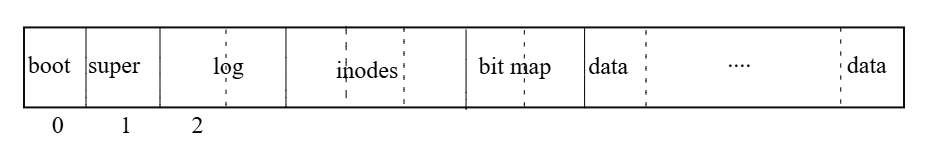
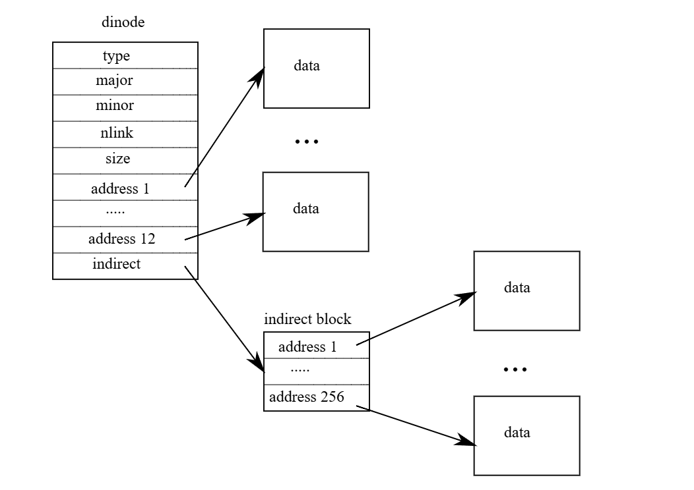

# xv6 riscv book chapter 8：File system

檔案系統的目的是為了組織與儲存資料。 檔案系統通常也會支援使用者與應用程式之間的資料共享，並具備資料的持久性，也就是在重新開機後資料仍然可用。 xv6 的檔案系統提供類 Unix 的檔案、目錄與路徑名稱（詳見第一章），並透過 virtio 硬碟來保存其資料以達成持久性。 這個檔案系統需要面對數個挑戰：

- 檔案系統需要在硬碟上建立資料結構，來表示具名目錄與檔案所組成的樹狀結構，記錄每個檔案內容所使用的區塊位置，並追蹤硬碟中哪些區域尚未被使用
- 檔案系統必須支援當機復原（crash recovery）。 也就是說，如果系統當機（例如電源故障）時中斷了操作，重新啟動後檔案系統仍必須能夠正常運作。 當機的風險在於，它可能會中斷一連串更新操作，使硬碟上的資料結構處於不一致的狀態（例如某個區塊既被某個檔案使用，又同時被標記為未使用）
- 不同的 process 可能會同時操作檔案系統，因此檔案系統的程式碼必須協調彼此之間的動作，以維護資料的一致性與不變性條件
- 存取硬碟的速度遠比存取記憶體慢上好幾個數量級，因此檔案系統必須在記憶體中維護一個常用區塊的快取

本章接下來將說明 xv6 是如何解決這些挑戰的

## 8.1 Overview

xv6 的檔案系統實作被劃分為七個層次，如圖 8.1 所示。 最底層是硬碟層，負責對 virtio 硬碟進行區塊的讀寫。 buffer cache 層會對磁碟區塊進行快取，並協調對其的存取，確保同一時間只有一個 kernel process 可以修改某個特定區塊中的資料。 logging 層允許更高層級的程式將多個區塊的更新包裝成一個 transaction，並保證在系統當機的情況下，這些更新能夠以原子地方式完成（也就是要麼全部更新，要麼全部不更新）

inode 層提供單一檔案的表示方式，每個檔案由一個 inode 表示，具有唯一的 i-number，以及一些儲存檔案內容的區塊。 directory 層把每個目錄實作成一種特殊的 inode，它的內容是一串目錄項目，每個項目包含一個檔案名稱與對應的 i-number。 pathname 層提供階層式路徑名稱，例如 `/usr/rtm/xv6/fs.c`，並透過遞迴查找來解析這些路徑。 file descriptor 層則將許多 Unix 資源（例如 pipe、裝置、檔案等）抽象成使用檔案系統介面的方式，讓應用程式開發者的工作變得更簡單


硬碟硬體傳統上會將磁碟上的資料呈現為一個個 512-byte block（也稱為 sector）的編號序列：sector 0 是最前面的 512 bytes，sector 1 是接下來的 512 bytes，以此類推。 作業系統在檔案系統中使用的區塊大小可以與硬碟的 sector 大小不同，但通常會是 sector 大小的倍數。 xv6 會將讀取進記憶體的磁碟區塊儲存在型別為 `struct buf` 的物件中。 這些結構中的資料有時可能與實際磁碟上的資料不同步：例如資料可能還沒從磁碟中讀取完成（硬碟還在讀取中但尚未返回該 sector 的內容），或者資料已被軟體修改了但尚未寫回磁碟

檔案系統必須規劃好要將 inode 與資料區塊存放在哪些磁碟位置。 為了達成這點，xv6 將整個磁碟劃分成幾個區段，如圖 8.2 所示。 檔案系統不使用 block 0（因為它是 boot sector）。 block 1 被稱為 superblock，其中包含檔案系統的中繼資料（例如檔案系統的區塊總數、資料區塊的數量、inode 的數量，以及用於 log 的區塊數）

從 block 2 開始是用來存放 log 的區塊。 在 log 區塊之後是 inode 區段，每個區塊會存放多個 inode。 再往後是 bitmap 區塊，用來追蹤哪些資料區塊已被使用。 剩下的區塊就是資料區塊，每一個要麼被 bitmap 標記為 free，要麼用來儲存檔案或目錄的內容。 superblock 會由一個名為 `mkfs` 的獨立程式填寫，它會建立初始的檔案系統



本章接下來將依序介紹每個層次，從 buffer cache 開始。 請特別注意那些設計良好的底層抽象是如何讓高層的設計變得更簡潔的

## 8.2 Buffer cache layer

buffer cache 有兩個主要任務：第一是同步對磁碟區塊的存取，確保記憶體中對每個區塊只有一個副本，並且同一時間只有一個 kernel 執行緒會使用該副本； 第二是對常用的區塊進行快取，避免每次都要從緩慢的硬碟中重新讀取。 相關程式碼實作位於 `bio.c`

buffer cache 對外提供的主要介面包括 `bread` 與 `bwrite`； 前者會取得一個「buf」，也就是某個磁碟區塊在記憶體中的副本，這份資料可以被讀取或修改，而後者則會將修改過的 buffer 寫回對應的磁碟區塊。 當 kernel 執行緒使用完這個 buffer 後，必須呼叫 `brelse` 來釋放該 buffer。 buffer cache 為每個 buffer 使用一個 sleep-lock，以確保同一時間只有一個執行緒能使用某個 buffer（也就是某個磁碟區塊）； `bread` 會回傳一個已上鎖的 buffer，而 `brelse` 則會釋放該鎖

buffer cache 中只有固定數量的 buffer 可用來儲存磁碟區塊，這表示如果檔案系統要求某個目前不在 cache 中的區塊，buffer cache 就必須回收一個目前用來儲存其他區塊的 buffer。 它會選擇最近最少使用（Least Recently Used, LRU）的那個 buffer 來回收並用於新的區塊。 這基於一個假設：最近最少使用的 buffer 很可能短期內也不會再被使用

## 8.3 Code: Buffer cache

buffer cache 是由多個 buffer 組成的 doubly-linked list。 `main` 函數會呼叫 `binit`（[kernel/main.c:27](https://github.com/mit-pdos/xv6-riscv/blob/riscv//kernel/main.c#L27)），並用靜態陣列 `buf` 中的 `NBUF` 個 buffer 初始化整個 doubly-linked list（[kernel/bio.c:43-52](https://github.com/mit-pdos/xv6-riscv/blob/riscv//kernel/bio.c#L43-L52)）。 在初始化之後，其他所有對 buffer cache 的存取都透過 `bcache.head` 指向的 linked list 來進行，而不再直接使用 `buf` 陣列

```c
struct {
  struct spinlock lock;
  struct buf buf[NBUF];

  // Linked list of all buffers, through prev/next.
  // Sorted by how recently the buffer was used.
  // head.next is most recent, head.prev is least.
  struct buf head;
} bcache;

void
binit(void)
{
  struct buf *b;

  initlock(&bcache.lock, "bcache");

  // Create linked list of buffers
  bcache.head.prev = &bcache.head;
  bcache.head.next = &bcache.head;
  for(b = bcache.buf; b < bcache.buf + NBUF; b++){
    b->next = bcache.head.next;
    b->prev = &bcache.head;
    initsleeplock(&b->lock, "buffer");
    bcache.head.next->prev = b;
    bcache.head.next = b;
  }
}
```

每個 buffer 都有兩個與其狀態有關的欄位。 `valid` 欄位表示這個 buffer 中目前包含了某個磁碟區塊的副本。 `disk` 欄位則表示該 buffer 的內容已經交由磁碟處理，也就是可能已經被磁碟寫入了（例如從磁碟讀資料到 `data` 陣列中）

```c
struct buf {
  int valid;   // has data been read from disk?
  int disk;    // does disk "own" buf?
  uint dev;
  uint blockno;
  struct sleeplock lock;
  uint refcnt;
  struct buf *prev; // LRU cache list
  struct buf *next;
  uchar data[BSIZE];
};
```

`bread`（[kernel/bio.c:93](https://github.com/mit-pdos/xv6-riscv/blob/riscv//kernel/bio.c#L93)）會呼叫 `bget` 來取得對應於某個 sector 的 buffer（[kernel/bio.c:97](https://github.com/mit-pdos/xv6-riscv/blob/riscv//kernel/bio.c#L97)）。 若這個 buffer 需要從磁碟讀取資料，`bread` 會呼叫 `virtio_disk_rw` 來執行讀取，然後才回傳這個 buffer

```c
// Return a locked buf with the contents of the indicated block.
struct buf*
bread(uint dev, uint blockno)
{
  struct buf *b;

  b = bget(dev, blockno);
  if(!b->valid) {
    virtio_disk_rw(b, 0);
    b->valid = 1;
  }
  return b;
}
```

`bget`（[kernel/bio.c:59](https://github.com/mit-pdos/xv6-riscv/blob/riscv//kernel/bio.c#L59)）會掃描整個 buffer list，尋找一個擁有指定裝置號與 sector 編號的 buffer（[kernel/bio.c:65-73](https://github.com/mit-pdos/xv6-riscv/blob/riscv//kernel/bio.c#L65-L73)）。 若有找到，`bget` 會為該 buffer 取得 sleep-lock，然後回傳這個已上鎖的 buffer

如果該 sector 沒有對應的快取 buffer，`bget` 就必須建一個新的，這可能會重複使用目前儲存其他 sector 的 buffer。 接著它會再掃描一次 buffer list，尋找一個未被使用的 buffer（`b->refcnt = 0`）； 只要符合這個條件就可以使用。 `bget` 接著會更新這個 buffer 的中繼資料，將其裝置編號與 sector 編號改成新的，並且為它上鎖。 特別注意，`b->valid = 0` 這行會強制讓 `bread` 之後從磁碟重新讀取資料，而不是錯誤地使用這個 buffer 之前的內容

每個 sector 最多只能有一個對應的快取 buffer，這點非常重要，因為這樣才能保證讀取端能看到寫入端的更新結果，同時檔案系統也仰賴對 buffer 上鎖來實現同步機制。 `bget` 為了確保這個不變性，會在執行第一次檢查（判斷某個區塊是否已存在於 cache）到第二次回收並設為新的 buffer 的整個過程中，持續持有 `bcache.lock`。 這個過程中會設定該 buffer 的 `dev`、`blockno` 與 `refcnt`。 這種設計可以讓「檢查快取是否存在」與「指定一個 buffer 來存放該區塊」這兩個步驟形成一個原子操作

```c
// Look through buffer cache for block on device dev.
// If not found, allocate a buffer.
// In either case, return locked buffer.
static struct buf*
bget(uint dev, uint blockno)
{
  struct buf *b;

  acquire(&bcache.lock);

  // Is the block already cached?
  for(b = bcache.head.next; b != &bcache.head; b = b->next){
    if(b->dev == dev && b->blockno == blockno){
      b->refcnt++;
      release(&bcache.lock);
      acquiresleep(&b->lock);
      return b;
    }
  }

  // Not cached.
  // Recycle the least recently used (LRU) unused buffer.
  for(b = bcache.head.prev; b != &bcache.head; b = b->prev){
    if(b->refcnt == 0) {
      b->dev = dev;
      b->blockno = blockno;
      b->valid = 0;
      b->refcnt = 1;
      release(&bcache.lock);
      acquiresleep(&b->lock);
      return b;
    }
  }
  panic("bget: no buffers");
}
```

`bget` 在離開 `bcache.lock` 的 critical section 之後再去取得 buffer 的 sleep-lock 是安全的，因為只要 `b->refcnt` 不為 0，就可以防止該 buffer 被重複用於其他磁碟區塊。 sleep-lock 用來保護對這個區塊內容的讀寫操作，而 `bcache.lock` 則用來保護「哪些磁碟區塊已被快取」的相關資訊

如果所有的 buffer 都在忙碌中，表示有太多 process 同時在執行檔案系統呼叫了； 這時 `bget` 會直接 panic。 比較溫和的處理方式是讓該 process 睡眠直到有 buffer 變得可用，但這樣會有導致 deadlock 的可能性

一旦 `bread`（若有需要）從磁碟讀取資料並回傳 buffer 給呼叫者，呼叫者就能獨佔這個 buffer，可以任意讀取或寫入裡面的資料。 如果呼叫者修改了 buffer，就必須呼叫 `bwrite` 將變更寫回磁碟，然後才能釋放 buffer。 `bwrite`（[kernel/bio.c:107](https://github.com/mit-pdos/xv6-riscv/blob/riscv//kernel/bio.c#L107)）會呼叫 `virtio_disk_rw` 與磁碟硬體溝通

```c
// Write b's contents to disk.  Must be locked.
void
bwrite(struct buf *b)
{
  if(!holdingsleep(&b->lock))
    panic("bwrite");
  virtio_disk_rw(b, 1);
}
```

當呼叫者使用完一個 buffer 時，必須呼叫 `brelse` 來釋放它（`brelse` 這個名稱是 b-release 的縮寫，雖然不好懂，但很值得學，因為它來自 Unix，並在 BSD、Linux、Solaris 等系統中沿用至今）。 `brelse`（[kernel/bio.c:117](https://github.com/mit-pdos/xv6-riscv/blob/riscv//kernel/bio.c#L117)）會釋放這個 buffer 的 sleep-lock，並將它移動到 linked list 的最前面（[kernel/bio.c:128-133](https://github.com/mit-pdos/xv6-riscv/blob/riscv//kernel/bio.c#L128-L133)）。 這讓整個 list 會根據 buffer 最近被使用的時間進行排序：list 最前面是最近被釋放的 buffer，最尾端是最久未使用的

```c
// Release a locked buffer.
// Move to the head of the most-recently-used list.
void
brelse(struct buf *b)
{
  if(!holdingsleep(&b->lock))
    panic("brelse");

  releasesleep(&b->lock);

  acquire(&bcache.lock);
  b->refcnt--;
  if (b->refcnt == 0) {
    // no one is waiting for it.
    b->next->prev = b->prev;
    b->prev->next = b->next;
    b->next = bcache.head.next;
    b->prev = &bcache.head;
    bcache.head.next->prev = b;
    bcache.head.next = b;
  }
  
  release(&bcache.lock);
}
```

`bget` 中的兩段迴圈就是利用了這種排序方式：在尋找既有 buffer 的那一段，最糟情況下會掃過整個 list，但若有良好的區域性參考性（locality），從 `bcache.head` 開始沿著 next 指標往後找，就能縮短搜尋時間。 而在找出可回收 buffer 的那段，則是從 list 的尾端開始，沿著 `prev` 指標反向找，選出最久未使用的 buffer

## 8.4 Logging layer

在檔案系統設計中，當機復原（crash recovery）是一個非常有趣的問題。 這個問題的來自於許多檔案系統的操作會包含多次對硬碟的寫入，如果在這些寫入只完成一部分時系統發生當機，那麼硬碟上的檔案系統可能會變成不一致的狀態。 例如，假設當機發生在執行 file truncation（將檔案長度設為 0 並釋放其內容區塊）的過程中。 根據磁碟寫入的順序不同，當機後可能會出現以下兩種情況之一：第一種是 inode 仍然指向某個實際上已被標記為「空閒」的區塊，第二種是某個區塊已被配置但卻沒有任何 inode 參考它

第二種情況相對比較無害； 但對於第一種，若某個 inode 仍然指向一個已被釋放的區塊，在重新開機後很可能會引發嚴重的問題。 因為在重新開機之後，kernel 可能會把該區塊分配給另一個檔案，結果就變成兩個不同的檔案意外地指向同一個區塊。 如果 xv6 有支援多個使用者，這樣的狀況甚至可能變成一個安全漏洞，因為原本的檔案擁有者就可以讀寫新的、屬於其他使用者的檔案資料

xv6 使用一種簡化的 logging 機制來解決檔案系統操作期間可能發生當機的問題。 xv6 的系統呼叫並不會直接修改硬碟上的檔案系統資料結構，而是先將所有預計要寫入的內容描述記錄到硬碟上的 log 中。 等到所有寫入動作都被記錄到 log 之後，系統呼叫會在磁碟上寫入一個特殊的 commit 記錄，表示 log 內包含了一筆完整的操作。 到了這個階段，系統呼叫才會把這些寫入實際套用到檔案系統的資料結構上。 當這些寫入完成之後，系統呼叫會刪除磁碟上的 log

如果系統發生當機並重新啟動，檔案系統的程式會在執行任何 process 之前先進行以下的復原程序。 若 log 被標記為包含一筆完整的操作，那麼復原程式就會將這筆操作所對應的寫入內容複製到對應的檔案系統資料結構中。 反之，如果 log 沒有被標記為包含完整操作，復原程式就會忽略這份 log。 最後，復原程式會將 log 從磁碟上清除

xv6 的 log 能解決檔案系統操作期間發生當機的問題的原因是，如果當機發生在操作完成 commit 之前，那麼磁碟上的 log 不會被標記為完成，復原程式就會忽略它，此時硬碟的狀態就像這筆操作根本沒開始過一樣。 如果當機發生在操作 commit 之後，那麼復原程式會重播這筆操作的所有寫入，儘管在當機之前這些寫入可能已經部分套用到其資料結構中了。 無論是哪種情況，這個 log 都讓檔案系統的操作在面對當機時具有原子性：在復原之後，要麼這筆操作的所有寫入都存在磁碟上，要麼一個寫入都沒有

## 8.5 Log design

log 儲存在一個已知的固定位置，這個位置由 superblock 指定。 log 的內容包含一個 header 區塊，後面接著一連串更新後的區塊副本（稱為「logged blocks」）。 header 區塊中會有一個 sector 編號的陣列，對應每個 logged block 各自的磁區編號，還會有一個 log block 數量的計數值

```c
// Contents of the header block, used for both the on-disk header block
// and to keep track in memory of logged block# before commit.
struct logheader {
  int n;
  int block[LOGSIZE];
};

struct log {
  struct spinlock lock;
  int start;
  int size;
  int outstanding; // how many FS sys calls are executing.
  int committing;  // in commit(), please wait.
  int dev;
  struct logheader lh;
};
struct log log;
```

::: tip  
這邊先把整個流程簡單紀錄一下，因為當初在看的時候真的看很久，這邊原文寫得不太好，對整個流程先有個認識，看後面的原文才比較看得懂，你也可以先跳過往後看，發現有問題再回來看一下這段

在 xv6 的日誌（log）實作裡，`struct logheader` 是寫入日誌區第一個磁區（header block）的資料結構，也會在記憶體中維持一份相同內容，並隨著 transaction 中的 `log_write()` 呼叫而更新。 換句話說，包含等等會看到的 `strcut log` 在內，兩者都只有一個全域的實例（`log` 與 `log.lh`）

一個 transaction 是一組「要麼全部成功，要麼全部不做」的磁碟操作組合。 這些操作在日誌中被一次性地記錄、提交（commit），保證就算在中途當機也不會只執行了一半、造成檔案系統損毀

一個 transaction 通常包含：

- 寫入 inode（例如檔案長度更新）
- 修改 bitmap（標記 block 是否被使用）
- 寫入實際的資料 block（檔案內容）

的操作，舉例來說：

```c
begin_op();
ilock(f->ip);
writei(f->ip, ...);  // 可能寫好幾個 block
iunlock(f->ip);
end_op(); // 若這是最後一個使用者，就觸發 commit()
```

整個 `begin_op()` 到 `end_op()` 就是一個 transaction。 在全域範圍內 transaction <span class = "yellow">一次只會有一筆</span>，它會使一個全域的鎖 `log.lock` 來管理。 當不同的 system call 同時呼叫 `begin_op` 時，如果符合其內部條件（後面會提），他就會將 `log.outstanding` 這個計數器加一，以表示它也參予了此次 `transaction`

而 `logheader.n` 是個計數器，用來記錄目前這筆 transaction 最後要寫多少個「硬碟上的資料區塊」； `logheader.block` 則是一個磁區編號的清單，用來記錄「這筆 transaction 修改了哪些資料區塊」，本身並不包含資料（你也可以看到它是 `int` 的陣列）。 真正的資料都放在 buffer cache 中（於 bio.c 中的 `bcache.buf`），而 log block 的資料也是存在 buffer cache 裡的，而且只有在 commit 時才會被建立

一般的系統呼叫要寫入 block 的時候，如上方的 `writei` 函式，其內都會呼叫 `log_write` 來將磁碟編號 `blockno` 填入 `logheader.block`，最後再等到呼叫 `end_op` 時再實際的去做這個寫操作，每當有 system call 呼叫對應的 `end_op`（和 `begin_op` 是一組的），`log.outstanding` 就會被減一

而當 `end_op` 內發現所有系統呼叫的寫入操作都被記錄下來後（`log.outstanding == 0`），換句話說就是最後一個呼叫 `end_op` 的人，會去呼叫 `commit` 這個函式。 也因此，當有多個系統呼叫的寫入操作正等著被執行時，`logheader.block` 內就會存著不同組系統呼叫的寫入操作所寫的 buffer

還有，從這裡你也可以發現，所謂的「一筆」transaction 其實是在「第一個 `begin_op()` 成功」那一刻開始，直到 `log.outstanding` 由 1 變 0 而觸發 `commit()` 後結束的。 如果同時有多個 system call 交錯執行，它們各自的 `begin_op … end_op` 區段都被包在同一筆 transaction 內，而不是「每個 system call 就是一筆 transaction」

最後，`commit` 這個函式是整個過程裡面最重要的函式，只會在這裡被呼叫，其主要做四件事

1. `write_log`：把 `logheader.block` 內紀錄的磁碟編號對應的「記憶體上的 buffer cache」裡面的內容，複製到「硬碟上的 log block」中：
     ```c
     struct buf *to = bread(log.dev, log.start+tail+1); // log block
     struct buf *from = bread(log.dev, log.lh.block[tail]); // cache block
     memmove(to->data, from->data, BSIZE);
     bwrite(to);  // write the log
     brelse(from);
     brelse(to);
     ```
2. `write_head`：把記憶體中的 `log.lh` 結構覆寫到硬碟上的日誌區（block 2，見圖 8.2）的第 0 個 sector
   - 此時硬碟上的日誌區就有了完整的「要寫的資料」與 `logheader` 的內容了
   - `logheader` 裡面記錄了這些硬碟上的日誌區內的 block 的內容等等要搬去哪裡
   - 到這裡 `commit` 的重點（防止當機）就完成了，此時如果當機了，由於硬碟上的日誌區都還存著這些資料要去哪，所以開機時就有辦法復原
3. `install_trans`：把硬碟日誌區中的那些 block 搬到正確的位置上
4. `log.lh.n = 0; write_head();`：將記憶體與硬碟上的 `logheader` 的資訊都清 0

整體流程大概就是這樣，從上面你也可以看到，log block 的內容其實就是其對應的 data block 的副本  
:::

若磁碟上的 header 區塊中的計數器欄位為 0，表示目前 log 中不存在任何的 transaction； 若為非零值，則表示 log 中已包含一筆完整且已 commit 的 transaction，且其中有指定數量的 logged blocks。 xv6 會在 commit 時寫入這個 header 區塊（而不是事前），並會在把 logged blocks 寫入檔案系統後，將計數器清 0。 因此如果 transaction 執行到一半當機，log header 區塊中的計數器就會是 0； 如果在 commit 之後才當機，那麼計數器會是非零值

每個系統呼叫的程式碼都會標示出寫入序列的起點與終點，在這之間的寫入對 crash 來說必須是原子的。 在讓多個 process 同時執行檔案系統操作的情況下，log 系統允許將多個系統呼叫的寫入操作累積在同一個 transaction 中。 因此，單個 commit 可能包含了多個完整系統呼叫的寫入。 為了避免某個系統呼叫的寫入被拆分到不同的 transaction 中，log 系統只有在沒有任何檔案系統相關的系統呼叫在執行時才會進行 commit

將多筆 transaction 一起進行 commit 的概念被稱為「group commit」。 group commit 能減少磁碟操作的次數，因為它可以將 commit 的固定成本分攤到多筆操作上。 此外，group commit 也會讓磁碟系統一次接收到較多筆寫入操作，有機會讓磁碟在一次旋轉期間就完成所有寫入。 雖然 xv6 所用的 virtio driver 並不支援這種 batching，但 xv6 的檔案系統設計仍然允許這種做法的存在

xv6 在磁碟上預留了一塊固定大小的空間用來存放 log。 每次 transaction 中由系統呼叫寫入的所有區塊數量必須能夠塞進這塊 log 空間。 這會產生兩個後果：

1. 不能讓任何一個系統呼叫寫入超過 log 空間大小的區塊數  
   - 這對大多數系統呼叫來說不是問題，但有兩個系統呼叫可能會寫入大量區塊：`write` 與 `unlink`
     - 對於一個大型檔案的 `write` 操作，可能需要寫入很多個 data block、bitmap block，甚至還包含一個 inode block
     - `unlink` 一個大型檔案也可能會涉及多個 bitmap block 與 inode 的寫入
   - xv6 的 `write` 系統呼叫會將大型寫入拆分成多個較小的操作，每次都能夠塞進 log； 而 `unlink` 則沒造成實務上的問題，因為 xv6 的 file system 通常只會用到一個 bitmap block
2. 由於 log 空間有限，在 logging system 確認一個系統呼叫的所有寫入能夠完全塞入剩餘的 log 空間之前，不能允許該系統呼叫開始執行

## 8.6 Code: logging

一個 system call 中使用日誌系統的典型方式如下所示：

```c
begin_op();
...
bp = bread(...);
bp->data[...] = ...;
log_write(bp);
...
end_op();
```

`begin_op`（[kernel/log.c:127](https://github.com/mit-pdos/xv6-riscv/blob/riscv//kernel/log.c#L127)）會等到日誌系統沒有在處理 commit，並且 log 中有足夠尚未被預留的空間，可以容納這次系統呼叫要寫入的資料後，才會繼續執行。 `log.outstanding` 會記錄目前有多少個系統呼叫預留了 log 空間，整體預留的空間大小為 `log.outstanding` 乘上 `MAXOPBLOCKS`。 將 `log.outstanding` 加一具有預留空間的功能，並能避免在這個系統呼叫的期間內觸發 commit。 程式碼保守地假設每次系統呼叫最多可能會寫入 `MAXOPBLOCKS` 個不同的 block

::: tip  
`begin_op()` 要做兩件事：

1. 確定可以塞得下
   - 空間分為兩種：
     - 已用空間 (`log.lh.n`)：這筆全域唯一的 transaction 已經記錄了多少「資料區塊」的數量
     - 預留空間：這是等等會用到的 log block，`log.outstanding` 代表有幾個 log block
2. 確定現在沒有 commit 在跑  
    因為 commit 會讀寫同一批 log block，若程序 A 在 commit、程序 B 又想 append 新 block，磁碟內容可能衝突

只有兩條件都成立，`begin_op()` 才會做 `log.outstanding++`，正式「卡位」成功，並持有這把額度直到 `end_op()`

至於對 commit 有「互斥」效果，是因為 commit 只會在 `log.outstanding` 變為 0 時觸發（見底下的 `end_op()`）。 任何其他的 system call 只要先 `begin_op()` 成功，`log.outstanding` 就大於 0，這期間 commit 一定不會開始。 也因此同一個 system call 內的多個 `log_write()` 肯定屬於同一筆 transaction，不怕被拆開  
:::

```c
// called at the start of each FS system call.
void
begin_op(void)
{
  acquire(&log.lock);
  while(1){
    if(log.committing){
      sleep(&log, &log.lock);
    } else if(log.lh.n + (log.outstanding+1)*MAXOPBLOCKS > LOGSIZE){
      // this op might exhaust log space; wait for commit.
      sleep(&log, &log.lock);
    } else {
      log.outstanding += 1;
      release(&log.lock);
      break;
    }
  }
}
```

xv6 中的 `log_write`（[kernel/log.c:215](https://github.com/mit-pdos/xv6-riscv/blob/riscv//kernel/log.c#L215)）會用來作為 `bwrite` 的代理（proxy）。 它會在記憶體中記錄該 block 的磁區編號，並為其在磁碟上的 log 中預留一個位置，同時會將這個 buffer 釘在 block cache 中，避免被 cache 排除。 這個 block 必須一直預留在 cache 中直到 commit 為止：在此之前，cache 中的資料是唯一的修改紀錄，在 commit 前不能把它寫回磁碟原本的位置，而且同一 transaction 中的其他讀取也必須能看到這些修改

`log_write` 會偵測在同一 transaction 中是否多次寫入了同一個 block，並讓該 block 重複使用同一個 log slot，這項最佳化被稱為吸收（absorption）。 這種情況很常見，例如：儲存多個檔案的 inode 的磁碟區在同一個 transaction 裡可能會被寫入好幾次。 透過將多次的磁碟寫入合併成一次，檔案系統可以節省 log 空間，並提升效能，因為最後只會有一個磁碟區的副本需要被寫入磁碟

```c
// Caller has modified b->data and is done with the buffer.
// Record the block number and pin in the cache by increasing refcnt.
// commit()/write_log() will do the disk write.
//
// log_write() replaces bwrite(); a typical use is:
//   bp = bread(...)
//   modify bp->data[]
//   log_write(bp)
//   brelse(bp)
void
log_write(struct buf *b)
{
  int i;

  acquire(&log.lock);
  if (log.lh.n >= LOGSIZE || log.lh.n >= log.size - 1)
    panic("too big a transaction");
  if (log.outstanding < 1)
    panic("log_write outside of trans");

  for (i = 0; i < log.lh.n; i++) {
    if (log.lh.block[i] == b->blockno)   // log absorption
      break;
  }
  log.lh.block[i] = b->blockno;
  if (i == log.lh.n) {  // Add new block to log?
    bpin(b);
    log.lh.n++;
  }
  release(&log.lock);
}
```

`end_op`（[kernel/log.c:147](https://github.com/mit-pdos/xv6-riscv/blob/riscv//kernel/log.c#L147)） 會先將 `log.outstanding` 減一。 如果計數器變成零，代表這是目前 transaction 中的最後一個系統呼叫，因此其會呼叫 `commit()` 來提交這筆 transaction：

```c
// called at the end of each FS system call.
// commits if this was the last outstanding operation.
void
end_op(void)
{
  int do_commit = 0;

  acquire(&log.lock);
  log.outstanding -= 1;
  if(log.committing)
    panic("log.committing");
  if(log.outstanding == 0){
    do_commit = 1;
    log.committing = 1;
  } else {
    // begin_op() may be waiting for log space,
    // and decrementing log.outstanding has decreased
    // the amount of reserved space.
    wakeup(&log);
  }
  release(&log.lock);

  if(do_commit){
    // call commit w/o holding locks, since not allowed
    // to sleep with locks.
    commit();
    acquire(&log.lock);
    log.committing = 0;
    wakeup(&log);
    release(&log.lock);
  }
}
```

整個 commit 的過程包含分為階段：

1. `write_log()`（[kernel/log.c:179](https://github.com/mit-pdos/xv6-riscv/blob/riscv//kernel/log.c#L179)）會把該 transaction 中被修改過的 block，從 buffer cache 複製到磁碟上與其對應的 slot
2. `write_head()`（[kernel/log.c:103](https://github.com/mit-pdos/xv6-riscv/blob/riscv//kernel/log.c#L103)）會把 log 的 header block 寫入磁碟：這就是 commit 點，如果系統在這步之後當機，恢復程序會根據 log 重播這次 transaction 的所有寫入
3. `install_trans`（[kernel/log.c:69](https://github.com/mit-pdos/xv6-riscv/blob/riscv//kernel/log.c#L69)）會從 log 中讀出每個 block，並將其寫入檔案系統中正確的位置
4. `end_op` 會將 log header 中的計數器清 0，這動作必須在下一筆 transaction 開始寫入 logged block 之前完成，否則若系統當機，會導致恢復時錯誤地將「前一筆 transaction 的 header」與「後一筆 transaction 的 logged block」搭配使用

```c
static void
commit()
{
  if (log.lh.n > 0) {
    write_log();     // Write modified blocks from cache to log
    write_head();    // Write header to disk -- the real commit
    install_trans(0); // Now install writes to home locations
    log.lh.n = 0;
    write_head();    // Erase the transaction from the log
  }
}
```

`initlog`（[kernel/log.c:55](https://github.com/mit-pdos/xv6-riscv/blob/riscv//kernel/log.c#L55)）會呼叫 `recover_from_log`（[kernel/log.c:117](https://github.com/mit-pdos/xv6-riscv/blob/riscv//kernel/log.c#L117)），而 `initlog` 則是在開機階段由 `fsinit` 呼叫的（[kernel/fs.c:42](https://github.com/mit-pdos/xv6-riscv/blob/riscv//kernel/fs.c#L42)），這會發生在第一個使用者行程啟動前（[kernel/proc.c:535](https://github.com/mit-pdos/xv6-riscv/blob/riscv//kernel/proc.c#L535)）。 它會讀取 log header，若 header 顯示 log 中包含一筆已提交的 transaction，`recover_from_log` 就會模擬 `end_op` 的動作來進行還原

```c
static void
recover_from_log(void)
{
  read_head();
  install_trans(1); // if committed, copy from log to disk
  log.lh.n = 0;
  write_head(); // clear the log
}
```

在 `filewrite`（[kernel/file.c:135](https://github.com/mit-pdos/xv6-riscv/blob/riscv//kernel/file.c#L135)）中可以看到一個使用 log 的例子，其 transaction 如下：

```c
begin_op();
ilock(f->ip);
r = writei(f->ip, ...);
iunlock(f->ip);
end_op();
```

這段程式碼被包在一個迴圈中，會將大型的寫入操作分成多個僅寫入少數磁區的小型 transaction，以避免 log 空間爆滿。 `writei` 呼叫的過程中會寫入許多不同的 block，包括該檔案的 inode、一個或多個 bitmap block，以及一些 data block

## 8.7 Code: Block allocator

檔案與目錄的內容都放在硬碟的 block 裡，而這些 block 必須從可用的空閒池中分配。 xv6 的區塊配置器在硬碟上維護一張「free bitmap」，一個 block 會對應到其中的一個位元。 位元為 0 表示該 block 為 free block； 為 1 表示已被使用。 建立檔案系統的程式 `mkfs` 會先把開機區、superblock、log 區塊、inode 區塊以及 bitmap block 對應的位元設為 1

區塊配置器提供兩個函式：`balloc` 用來分配新的硬碟區塊，`bfree` 用來釋放硬碟區塊。 `balloc` 裡的迴圈（[kernel/fs.c:72](https://github.com/mit-pdos/xv6-riscv/blob/riscv//kernel/fs.c#L72)）會一路從 block 0 檢查到 `sb.size`（檔案系統的總 block 數），以尋找 bitmap 為 0 的 block（也就是目前空閒的 block）。 一旦找到，就把對應的 bitmap 設成 1，並回傳該 block

為了效率，整個掃描拆成兩層：外層一次讀取一個「bitmap block」，內層檢查這個 bitmap block 裡的 `BPB` 個位元。 若兩個行程同時嘗試分配 block，理論上會產生競爭，但實際上 buffer cache 會保證同一個 bitmap block 在同一時間只會被一個行程持有，因此避免了這種競爭

::: tip  
`sb.size` 來自 superblock，代表檔案系統容量。 因為 bitmap 本身也存放在硬碟上，掃描時必須先把 bitmap 的內容讀進快取（buffer cache）。 而 `BPB = (block size in bytes) × 8`，意思是一個 bitmap block 可以表示多少 data block，在 xv6 的實作中 `BPB = 1024 * 8`。 把掃描拆兩層可以減少 I/O 次數：一次讀進來就檢查整個 bitmap block，而不是每找一個位元就讀一次硬碟  
:::

```c
// Allocate a zeroed disk block.
// returns 0 if out of disk space.
static uint
balloc(uint dev)
{
  int b, bi, m;
  struct buf *bp;

  bp = 0;
  for(b = 0; b < sb.size; b += BPB){
    bp = bread(dev, BBLOCK(b, sb));
    for(bi = 0; bi < BPB && b + bi < sb.size; bi++){
      m = 1 << (bi % 8);
      if((bp->data[bi/8] & m) == 0){  // Is block free?
        bp->data[bi/8] |= m;  // Mark block in use.
        log_write(bp);
        brelse(bp);
        bzero(dev, b + bi);
        return b + bi;
      }
    }
    brelse(bp);
  }
  printf("balloc: out of blocks\n");
  return 0;
}
```

`bfree`（[kernel/fs.c:92](https://github.com/mit-pdos/xv6-riscv/blob/riscv//kernel/fs.c#L92)）會定位到正確的 bitmap block，然後把相應的位元清 0。 同樣地，`bread` 與 `brelse` 的互斥效果讓程式無需再顯式地加鎖

和本章稍後介紹的大部分程式碼一樣，`balloc` 與 `bfree` 必須包在同一筆 transaction 裡呼叫

## 8.8 Inode layer

「inode」一詞有兩種相關含義：其一指磁碟上的資料結構，內含檔案大小與 data block 的位置清單； 其二指記憶體中的 inode，除了持有該 on-disk inode 的副本，還帶有核心執行時所需的額外資訊

磁碟上的所有 inode 連續存放在一段稱作 inode block 的區域中； 由於每個 inode 大小固定，只要給定編號 `n`，就能直接定位到第 `n` 個 inode。 實作上，這個 `n` 就是 inode number（亦稱 i-number），用來唯一標識一個 inode

on-disk inode 以 `struct dinode`（[kernel/fs.h:32](https://github.com/mit-pdos/xv6-riscv/blob/riscv//kernel/fs.h#L32)）定義：`type` 欄位區分一般檔案、目錄與特殊檔案（裝置），若為 0 代表此 inode 為 free inode； `nlink` 記錄有多少 directory entry 指向此 inode，用來判斷何時可釋放該 inode 及其 data block； `size` 保存檔案內容的位元組數； `addrs` 陣列存放承載檔案內容之磁碟 block 的號碼

```c
// On-disk inode structure
struct dinode {
  short type;           // File type
  short major;          // Major device number (T_DEVICE only)
  short minor;          // Minor device number (T_DEVICE only)
  short nlink;          // Number of links to inode in file system
  uint size;            // Size of file (bytes)
  uint addrs[NDIRECT+1];   // Data block addresses
};
```

核心將活躍中的 inode 保存在一張 itable 中； `struct inode`（[kernel/file.h:17](https://github.com/mit-pdos/xv6-riscv/blob/riscv//kernel/file.h#L17)）就是記憶體版本的 `struct dinode`。 只有當程式碼持有 C 指標指向該 inode 時，核心才會把它留在記憶體； `ref` 欄位用來計數這些指標，若變為零就會把 inode 從 itable 中移除。 `iget` 與 `iput` 分別負責取得及歸還 inode 指標，並調整 `ref`。 這些指標可能來自檔案描述符、目前的工作目錄或暫時性地核心流程（例如 `exec`）

```c
// in-memory copy of an inode
struct inode {
  uint dev;           // Device number
  uint inum;          // Inode number
  int ref;            // Reference count
  struct sleeplock lock; // protects everything below here
  int valid;          // inode has been read from disk?

  short type;         // copy of disk inode
  short major;
  short minor;
  short nlink;
  uint size;
  uint addrs[NDIRECT+1];
};

// fs.c:
struct {
  struct spinlock lock;
  struct inode inode[NINODE];
} itable;
```

xv6 的 inode 程式碼用了四種鎖或與鎖類似的機制：`itable.lock` 保證「同一個 inode 最多只在 inode table 中出現一次」以及「`ref` 計數正確」這兩項不變式； 每個記憶體 inode 內的 `lock`（sleep-lock）負責確保對 inode 欄位與其檔案／目錄內容區塊的互斥存取； `ref` 只要大於零，系統就會將 inode 維持在表中，且不會把這個槽位給別的 inode 用； 最後，`nlink` 欄位會記錄參考到該檔案的 directory entry 數量，只要大於零，xv6 就不會釋放該 inode

在對應的 `iput()` 呼叫之前，由 `iget()` 取得的 `struct inode` 的指標保證是有效的：該 inode 不會被刪除，且這段記憶體不會指派給別的 inode。 `iget()` 提供非獨占（non-exclusive）存取，因此同一 inode 可被多個指標共用。 檔案系統中有大量程式碼仰賴此語義，這使其既能長期持有 inode（如開啟檔案、目前目錄），又能在處理多個 inode（如路徑解析）時避免競爭與死鎖

```c
// Find the inode with number inum on device dev
// and return the in-memory copy. Does not lock
// the inode and does not read it from disk.
static struct inode*
iget(uint dev, uint inum)
{
  struct inode *ip, *empty;

  acquire(&itable.lock);

  // Is the inode already in the table?
  empty = 0;
  for(ip = &itable.inode[0]; ip < &itable.inode[NINODE]; ip++){
    if(ip->ref > 0 && ip->dev == dev && ip->inum == inum){
      ip->ref++;
      release(&itable.lock);
      return ip;
    }
    if(empty == 0 && ip->ref == 0)    // Remember empty slot.
      empty = ip;
  }

  // Recycle an inode entry.
  if(empty == 0)
    panic("iget: no inodes");

  ip = empty;
  ip->dev = dev;
  ip->inum = inum;
  ip->ref = 1;
  ip->valid = 0;
  release(&itable.lock);

  return ip;
}

...

// Drop a reference to an in-memory inode.
// If that was the last reference, the inode table entry can
// be recycled.
// If that was the last reference and the inode has no links
// to it, free the inode (and its content) on disk.
// All calls to iput() must be inside a transaction in
// case it has to free the inode.
void
iput(struct inode *ip)
{
  acquire(&itable.lock);

  if(ip->ref == 1 && ip->valid && ip->nlink == 0){
    // inode has no links and no other references: truncate and free.

    // ip->ref == 1 means no other process can have ip locked,
    // so this acquiresleep() won't block (or deadlock).
    acquiresleep(&ip->lock);

    release(&itable.lock);

    itrunc(ip);
    ip->type = 0;
    iupdate(ip);
    ip->valid = 0;

    releasesleep(&ip->lock);

    acquire(&itable.lock);
  }

  ip->ref--;
  release(&itable.lock);
}
```

`iget` 回傳的 `struct inode` 可能尚未載入任何有效內容； 為確保其中含有對應的 on-disk inode，程式需呼叫 `ilock`。 `ilock` 會鎖住 inode（防止其他行程再對它做一次 `ilock`）並在尚未讀取時從磁碟載入該 inode，之後可用 `iunlock` 釋放該鎖。 將「取得指標」與「加鎖」分離有助於在某些情況下避免死鎖，例如查找目錄時需同時處理多個 inode。 多個行程可同時持有 `iget` 得到的指標，但同一時間僅允許一個行程鎖住該 inode

```c
// Lock the given inode.
// Reads the inode from disk if necessary.
void
ilock(struct inode *ip)
{
  struct buf *bp;
  struct dinode *dip;

  if(ip == 0 || ip->ref < 1)
    panic("ilock");

  acquiresleep(&ip->lock);

  if(ip->valid == 0){
    bp = bread(ip->dev, IBLOCK(ip->inum, sb));
    dip = (struct dinode*)bp->data + ip->inum%IPB;
    ip->type = dip->type;
    ip->major = dip->major;
    ip->minor = dip->minor;
    ip->nlink = dip->nlink;
    ip->size = dip->size;
    memmove(ip->addrs, dip->addrs, sizeof(ip->addrs));
    brelse(bp);
    ip->valid = 1;
    if(ip->type == 0)
      panic("ilock: no type");
  }
}
```

inode table 只保存那些仍被核心程式或資料結構持有 C 指標的 inode，它的首要任務是去協調多行程的存取。 順帶一提，它也剛好會把常用的 inode 快取起來，但這是次要的功能，因為如果某個 inode 經常會被使用到，那 buffer cache 大多也會把對應的磁碟區塊留在記憶體內。 當程式修改記憶體中的 inode 時，會呼叫 `iupdate` 將更動寫回磁碟

```c
// Copy a modified in-memory inode to disk.
// Must be called after every change to an ip->xxx field
// that lives on disk.
// Caller must hold ip->lock.
void
iupdate(struct inode *ip)
{
  struct buf *bp;
  struct dinode *dip;

  bp = bread(ip->dev, IBLOCK(ip->inum, sb));
  dip = (struct dinode*)bp->data + ip->inum%IPB;
  dip->type = ip->type;
  dip->major = ip->major;
  dip->minor = ip->minor;
  dip->nlink = ip->nlink;
  dip->size = ip->size;
  memmove(dip->addrs, ip->addrs, sizeof(ip->addrs));
  log_write(bp);
  brelse(bp);
}
```

## 8.9 Code: Inodes

當需要配置新 inode（例如建立檔案）時，xv6 會呼叫 `ialloc`（[kernel/fs.c:199](https://github.com/mit-pdos/xv6-riscv/blob/riscv//kernel/fs.c#L199)）。 `ialloc` 與 `balloc` 類似：它逐個掃描磁碟上的 inode block，尋找標記為空閒的 inode； 一旦找到，就把新的 type 寫回磁碟以宣告佔用，並呼叫 `iget`（[kernel/fs.c:213](https://github.com/mit-pdos/xv6-riscv/blob/riscv//kernel/fs.c#L213)）回傳 inode table 中的項目。 `ialloc` 能正常運作的關鍵是同時間只有一個行程持有 `bp` 指標，確保不會有另一行程同時看到該 inode 可用並試圖搶占它

```c
// Allocate an inode on device dev.
// Mark it as allocated by  giving it type type.
// Returns an unlocked but allocated and referenced inode,
// or NULL if there is no free inode.
struct inode*
ialloc(uint dev, short type)
{
  int inum;
  struct buf *bp;
  struct dinode *dip;

  for(inum = 1; inum < sb.ninodes; inum++){
    bp = bread(dev, IBLOCK(inum, sb));
    dip = (struct dinode*)bp->data + inum%IPB;
    if(dip->type == 0){  // a free inode
      memset(dip, 0, sizeof(*dip));
      dip->type = type;
      log_write(bp);   // mark it allocated on the disk
      brelse(bp);
      return iget(dev, inum);
    }
    brelse(bp);
  }
  printf("ialloc: no inodes\n");
  return 0;
}
```

`iget`（[kernel/fs.c:247](https://github.com/mit-pdos/xv6-riscv/blob/riscv//kernel/fs.c#L247)）會在 inode table 中搜尋符合指定裝置與 inode number 條件的活躍項目（`ip->ref > 0`）； 若找到，就回傳該 inode 的新參考（[kernel/fs.c:256-260](https://github.com/mit-pdos/xv6-riscv/blob/riscv//kernel/fs.c#L256-L260)）。 搜尋過程中它會將遇到的第一個空槽暫存起來（[kernel/fs.c:261-262](https://github.com/mit-pdos/xv6-riscv/blob/riscv//kernel/fs.c#L261-L262)），以便在沒找到的時候用來放入新的 table 項目

```c
// Find the inode with number inum on device dev
// and return the in-memory copy. Does not lock
// the inode and does not read it from disk.
static struct inode*
iget(uint dev, uint inum)
{
  struct inode *ip, *empty;

  acquire(&itable.lock);

  // Is the inode already in the table?
  empty = 0;
  for(ip = &itable.inode[0]; ip < &itable.inode[NINODE]; ip++){
    if(ip->ref > 0 && ip->dev == dev && ip->inum == inum){
      ip->ref++;
      release(&itable.lock);
      return ip;
    }
    if(empty == 0 && ip->ref == 0)    // Remember empty slot.
      empty = ip;
  }

  // Recycle an inode entry.
  if(empty == 0)
    panic("iget: no inodes");

  ip = empty;
  ip->dev = dev;
  ip->inum = inum;
  ip->ref = 1;
  ip->valid = 0;
  release(&itable.lock);

  return ip;
}
```

在讀寫 inode 的中繼資料或內容前，程式必須先以 `ilock`（[kernel/fs.c:293](https://github.com/mit-pdos/xv6-riscv/blob/riscv//kernel/fs.c#L293)）函式將該 inode 上鎖，該函式內使用的是 sleep-lock。 在 `ilock` 獨占了該 inode 的存取權後，它就會在需要時從磁碟（實際上多半是 buffer cache）中讀取 inode。 `iunlock`（[kernel/fs.c:321](https://github.com/mit-pdos/xv6-riscv/blob/riscv//kernel/fs.c#L321)）則會釋放該 sleep-lock，喚醒等待此鎖的其他行程

```c
// Lock the given inode.
// Reads the inode from disk if necessary.
void
ilock(struct inode *ip)
{
  struct buf *bp;
  struct dinode *dip;

  if(ip == 0 || ip->ref < 1)
    panic("ilock");

  acquiresleep(&ip->lock);

  if(ip->valid == 0){
    bp = bread(ip->dev, IBLOCK(ip->inum, sb));
    dip = (struct dinode*)bp->data + ip->inum%IPB;
    ip->type = dip->type;
    ip->major = dip->major;
    ip->minor = dip->minor;
    ip->nlink = dip->nlink;
    ip->size = dip->size;
    memmove(ip->addrs, dip->addrs, sizeof(ip->addrs));
    brelse(bp);
    ip->valid = 1;
    if(ip->type == 0)
      panic("ilock: no type");
  }
}

// Unlock the given inode.
void
iunlock(struct inode *ip)
{
  if(ip == 0 || !holdingsleep(&ip->lock) || ip->ref < 1)
    panic("iunlock");

  releasesleep(&ip->lock);
}
```

`iput`（[kernel/fs.c:337](https://github.com/mit-pdos/xv6-riscv/blob/riscv//kernel/fs.c#L337)）會透過將參考計數減一（[kernel/fs.c:360](https://github.com/mit-pdos/xv6-riscv/blob/riscv//kernel/fs.c#L360)）來釋放指向某 inode 的 C 語言指標； 如果它是最後一個參考，則它在 inode table 中的槽位就會轉為空閒槽位，供其他 inode 使用

如果 `iput` 發現某個 inode 已不再被任何 C 指標所參考，且也沒有任何硬連結指向它（也就是沒有出現在任何目錄中），那麼它會釋放該 inode 和其對應的 data block。 `iput` 會呼叫 `itrunc`，將檔案截短為 0 位元組來釋放資料區塊，接著將該 inode 的類型欄位設為 0（代表未分配），最後把 inode 寫回磁碟（[kernel/fs.c:342](https://github.com/mit-pdos/xv6-riscv/blob/riscv//kernel/fs.c#L342)）

`iput` 釋放 inode 時的 locking 機制值得深入探討。 一種潛在風險是：其他執行緒可能正在 `ilock` 中等待這個 inode，例如想要讀取某個檔案或列出某個目錄，此時若 inode 已被釋放則會出現錯誤。 不過這種情況不會發生，因為如果某個 inode 沒有 link，且 `ip->ref` 是 1，那麼除了目前呼叫 `iput` 的執行緒外，系統中沒有其他地方會持有指向這個 inode 的指標

另一種潛在風險是：釋放時同時有另一個執行緒呼叫 `ialloc`，並且選中了 `iput` 正在釋放的那個 inode。 不過這種情況只有在 `iupdate` 將 inode 的 type 寫成 0（代表未分配）後才會發生，因此這樣的競爭條件是良性的：因為分配 inode 的那個執行緒會在讀寫 inode 前先取得該 inode 的 sleep-lock，此時 `iput` 已經完成它的動作了

`iput()` 可能會對硬碟進行寫入。 這代表，只要是會使用到檔案系統的 system call，就有可能對硬碟寫入，因為該 system call 有可能是系統中最後一個持有該檔案參照的地方。 即使像 `read()` 這種看起來是唯讀的呼叫，最終也可能呼叫到 `iput()`。 因此，只要是涉及檔案系統的 system call，即使表面上是唯讀的，也必須包在 transaction 裡

`iput()` 和系統崩潰之間存在一個棘手的交互情況。 當某個檔案的 link count 降到 0 時，`iput()` 不會馬上把檔案截斷，因為可能還有某個 process 持有對該 inode 的記憶體參照：有某個 process 曾成功開啟該檔案並可能會再進行讀寫。 不過，如果在最後一個 process 關閉檔案描述符之前系統崩潰，那麼該檔案在硬碟上會仍被標記為 allocated，但已經沒有任何 directory entry 指向它了

檔案系統處理這種情況的方法有兩種。 最簡單的方式是在重開機後進行 recovery 時，掃描整個檔案系統，找出那些被標記為 allocated 卻沒有任何 directory entry 指向它們的檔案。 只要找到這種檔案，就可以將其釋放

第二種解法則不需掃描整個檔案系統。 在這個解法中，檔案系統會在磁碟上（例如記錄在 super block 中）紀錄那些 link count 為 0、但 reference count 尚未為 0 的 inode inumber。 當 reference count 最終也降到 0、檔案真正被刪除時，系統就從該列表中移除該 inode。 若發生崩潰，系統在 recovery 階段就可以釋放這個列表中遺留下來的檔案

xv6 沒有實作上述任何一種解法，這代表即使某些 inode 已經不再被使用了，它們在硬碟上仍可能被標記為 allocated。 隨著時間推移，這可能導致 xv6 耗盡所有磁碟空間

## 8.10 Code: Inode content

磁碟上的 inode 結構為 `struct dinode`，其中包含了一個大小欄位與一個 block 編號的陣列（見圖 8.3）。 inode 的資料儲存在 `dinode` 內 `addrs` 陣列所列出的那些 block 中。 這個陣列的前 `NDIRECT` 個項目對應的 block 被稱為 direct blocks； 而接下來的 `NINDIRECT` 個 block 則不直接列在 inode 中，而是儲存在一個稱為 indirect block 的 data block 裡



indirect block 的位址被放在 addrs 陣列的最後一個項目中。 也就是說，一個檔案的前 12 KB（`NDIRECT × BSIZE`）可以直接從 inode 裡所列出的 block 取得，而後續的 256 KB（`NINDIRECT × BSIZE`）則必須透過查找 indirect block 才能取得。 這樣的設計對磁碟比較友善，但對於使用者程式來說處理起來就較為複雜

`bmap` 函式負責處理這種表示法的細節，使得像 `readi` 和 `writei` 這類較高階的函式無須處理這些複雜性。 `bmap` 會回傳 inode `ip` 的第 `bn` 個 data block 對應的磁碟 block 編號。 如果該 block 尚未配置，`bmap` 就會配置一個新的 block

`bmap` 函式（[kernel/fs.c:383](https://github.com/mit-pdos/xv6-riscv/blob/riscv//kernel/fs.c#L383)）首先會處理前 `NDIRECT` 個 data block，因為它直接列在 inode 裡（[kernel/fs.c:388-396](https://github.com/mit-pdos/xv6-riscv/blob/riscv//kernel/fs.c#L388-L396)）所以處理起來比較簡單。 接下來的 `NINDIRECT` 個 data block 則列在 indirect block 中，其位址存放於 `ip->addrs[NDIRECT]`。 `bmap` 會先從磁碟讀取這個 indirect block（[kernel/fs.c:407](https://github.com/mit-pdos/xv6-riscv/blob/riscv//kernel/fs.c#L407)），然後從這個 block 的適當位置讀出正確的 block 編號（[kernel/fs.c:408](https://github.com/mit-pdos/xv6-riscv/blob/riscv//kernel/fs.c#L408)）。 如果傳入的區塊編號超過 `NDIRECT + NINDIRECT`，`bmap` 會觸發 panic； `writei` 裡會有邏輯先進行檢查，以避免這種情況發生（[kernel/fs.c:513](https://github.com/mit-pdos/xv6-riscv/blob/riscv//kernel/fs.c#L513)）

```c
// Inode content
//
// The content (data) associated with each inode is stored
// in blocks on the disk. The first NDIRECT block numbers
// are listed in ip->addrs[].  The next NINDIRECT blocks are
// listed in block ip->addrs[NDIRECT].


// Return the disk block address of the nth block in inode ip.
// If there is no such block, bmap allocates one.
// returns 0 if out of disk space.
static uint
bmap(struct inode *ip, uint bn)
{
  uint addr, *a;
  struct buf *bp;

  if(bn < NDIRECT){
    if((addr = ip->addrs[bn]) == 0){
      addr = balloc(ip->dev);
      if(addr == 0)
        return 0;
      ip->addrs[bn] = addr;
    }
    return addr;
  }
  bn -= NDIRECT;

  if(bn < NINDIRECT){
    // Load indirect block, allocating if necessary.
    if((addr = ip->addrs[NDIRECT]) == 0){
      addr = balloc(ip->dev);
      if(addr == 0)
        return 0;
      ip->addrs[NDIRECT] = addr;
    }
    bp = bread(ip->dev, addr);
    a = (uint*)bp->data;
    if((addr = a[bn]) == 0){
      addr = balloc(ip->dev);
      if(addr){
        a[bn] = addr;
        log_write(bp);
      }
    }
    brelse(bp);
    return addr;
  }

  panic("bmap: out of range");
}
```

`bmap` 會在需要時動態配置區塊。 當 `ip->addrs[]` 或 indirect block 中的某一個項目為 0 時，表示對應的 data block 尚未配置。 一旦 `bmap` 遇到這樣的情況，就會即時分配一個新的 data block，並將其 block 編號填入原本為 0 的位置（[kernel/fs.c:389-390](https://github.com/mit-pdos/xv6-riscv/blob/riscv//kernel/fs.c#L513) & [kernel/fs.c:401-402](https://github.com/mit-pdos/xv6-riscv/blob/riscv//kernel/fs.c#L401-L402)）

`itrunc` 會釋放一個檔案所使用的所有 data block，並將 inode 的大小欄位設為 0。 `itrunc`（[kernel/fs.c:426](https://github.com/mit-pdos/xv6-riscv/blob/riscv//kernel/fs.c#L426)）會先釋放所有 direct block（[kernel/fs.c:432-437](https://github.com/mit-pdos/xv6-riscv/blob/riscv//kernel/fs.c#L432-L437)），接著釋放 indirect block 中列出的所有 data block（[kernel/fs.c:442-445](https://github.com/mit-pdos/xv6-riscv/blob/riscv//kernel/fs.c#L442-L445)），最後再釋放那個用來記錄間接位址的 indirect block 本身（[kernel/fs.c:447-448](https://github.com/mit-pdos/xv6-riscv/blob/riscv//kernel/fs.c#L447-L448)）

```c
// Truncate inode (discard contents).
// Caller must hold ip->lock.
void
itrunc(struct inode *ip)
{
  int i, j;
  struct buf *bp;
  uint *a;

  for(i = 0; i < NDIRECT; i++){
    if(ip->addrs[i]){
      bfree(ip->dev, ip->addrs[i]);
      ip->addrs[i] = 0;
    }
  }

  if(ip->addrs[NDIRECT]){
    bp = bread(ip->dev, ip->addrs[NDIRECT]);
    a = (uint*)bp->data;
    for(j = 0; j < NINDIRECT; j++){
      if(a[j])
        bfree(ip->dev, a[j]);
    }
    brelse(bp);
    bfree(ip->dev, ip->addrs[NDIRECT]);
    ip->addrs[NDIRECT] = 0;
  }

  ip->size = 0;
  iupdate(ip);
}
```

`bmap` 讓 `readi` 和 `writei` 能夠輕鬆地存取 inode 的資料。 `readi`（[kernel/fs.c:472](https://github.com/mit-pdos/xv6-riscv/blob/riscv//kernel/fs.c#L472)）一開始會先確認傳入的 offset 和資料長度是否有超過檔案結尾。 若從檔案末尾之後開始讀取，會直接回傳錯誤（[kernel/fs.c:477-478](https://github.com/mit-pdos/xv6-riscv/blob/riscv//kernel/fs.c#L477-L478)）； 若讀取範圍涵蓋到檔案尾端，則會只回傳有效資料長度內的部分（[kernel/fs.c:479-480](https://github.com/mit-pdos/xv6-riscv/blob/riscv//kernel/fs.c#L479-L480)）。 接著進入主迴圈，每次處理一個 data block，並從 buffer 複製資料到 `dst`（[kernel/fs.c:482-494](https://github.com/mit-pdos/xv6-riscv/blob/riscv//kernel/fs.c#L482-L494)）

```c
// Read data from inode.
// Caller must hold ip->lock.
// If user_dst==1, then dst is a user virtual address;
// otherwise, dst is a kernel address.
int
readi(struct inode *ip, int user_dst, uint64 dst, uint off, uint n)
{
  uint tot, m;
  struct buf *bp;

  if(off > ip->size || off + n < off)
    return 0;
  if(off + n > ip->size)
    n = ip->size - off;

  for(tot=0; tot<n; tot+=m, off+=m, dst+=m){
    uint addr = bmap(ip, off/BSIZE);
    if(addr == 0)
      break;
    bp = bread(ip->dev, addr);
    m = min(n - tot, BSIZE - off%BSIZE);
    if(either_copyout(user_dst, dst, bp->data + (off % BSIZE), m) == -1) {
      brelse(bp);
      tot = -1;
      break;
    }
    brelse(bp);
  }
  return tot;
}
```

`writei`（[kernel/fs.c:506](https://github.com/mit-pdos/xv6-riscv/blob/riscv//kernel/fs.c#L506)）在邏輯上與 `readi` 幾乎相同，但有三個差異：若寫入動作發生在檔案尾端或越過尾端，則會使檔案大小成長，最多可達最大檔案限制（[kernel/fs.c:513-514](https://github.com/mit-pdos/xv6-riscv/blob/riscv//kernel/fs.c#L513-L514)）； 寫入時是將資料從使用者空間複製到 buffer（[kernel/fs.c:522](https://github.com/mit-pdos/xv6-riscv/blob/riscv//kernel/fs.c#L522)）； 若寫入後檔案大小變大，則 `writei` 也會更新 inode 的檔案大小欄位（[kernel/fs.c:530-531](https://github.com/mit-pdos/xv6-riscv/blob/riscv//kernel/fs.c#L530-L531)）

```c
// Write data to inode.
// Caller must hold ip->lock.
// If user_src==1, then src is a user virtual address;
// otherwise, src is a kernel address.
// Returns the number of bytes successfully written.
// If the return value is less than the requested n,
// there was an error of some kind.
int
writei(struct inode *ip, int user_src, uint64 src, uint off, uint n)
{
  uint tot, m;
  struct buf *bp;

  if(off > ip->size || off + n < off)
    return -1;
  if(off + n > MAXFILE*BSIZE)
    return -1;

  for(tot=0; tot<n; tot+=m, off+=m, src+=m){
    uint addr = bmap(ip, off/BSIZE);
    if(addr == 0)
      break;
    bp = bread(ip->dev, addr);
    m = min(n - tot, BSIZE - off%BSIZE);
    if(either_copyin(bp->data + (off % BSIZE), user_src, src, m) == -1) {
      brelse(bp);
      break;
    }
    log_write(bp);
    brelse(bp);
  }

  if(off > ip->size)
    ip->size = off;

  // write the i-node back to disk even if the size didn't change
  // because the loop above might have called bmap() and added a new
  // block to ip->addrs[].
  iupdate(ip);

  return tot;
}
```

`stati` 函式（[kernel/fs.c:458](https://github.com/mit-pdos/xv6-riscv/blob/riscv//kernel/fs.c#L458)）會將 inode 的 metadata 複製到 `stat` 結構中，該結構會透過 `stat` 系統呼叫暴露給使用者程式

## 8.11 Code: directory layer

目錄在內部的實作方式和一般檔案非常類似。 它的 inode 類型為 `T_DIR`，其資料部分則是一連串的 directory entry。 每個 entry 是一個 `struct dirent`（[kernel/fs.h:56](https://github.com/mit-pdos/xv6-riscv/blob/riscv//kernel/fs.h#L56)），其中包含了一個名稱以及一個 inode number。 名稱最多為 `DIRSIZ`（14）個字元； 若長度不足，則以 NULL（0）位元組作為結尾。 inode number 為零的 directory entry 被視為未使用的空白 entry

```c
// Directory is a file containing a sequence of dirent structures.
#define DIRSIZ 14

struct dirent {
  ushort inum;
  char name[DIRSIZ];
};
```

`dirlookup` 函式（[kernel/fs.c:552](https://github.com/mit-pdos/xv6-riscv/blob/riscv//kernel/fs.c#L552)）會在某個目錄（`dp`）中搜尋名稱符合指定字串的 entry。 若找到了，就會回傳對應的 inode（未加鎖），並將 `*poff` 設為該 entry 在該目錄中所對應的位元組偏移量，這是為了讓呼叫者可以對該 entry 進行修改。 如果 `dirlookup` 成功找到對應名稱的 entry，它會更新 `*poff`，並透過 `iget` 取得該 inode 並回傳（仍是未加鎖狀態）

`dirlookup` 是 `iget` 會回傳「未加鎖」inode 的主因，因為呼叫 `dirlookup` 的 caller 已經先對 `dp` 上鎖了，因此如果搜尋的是 `.`（代表目前目錄的別名），如果在回傳前試圖再次對該 inode 上鎖，會導致對 `dp` 的重複上鎖並造成 deadlock 實際上還有更複雜的 deadlock 情境，涉及多個 process 與 `..`（父目錄的別名），所以 `.` 並不是唯一的問題。 因此正確做法是讓 caller 在收到 inode 後先解鎖 `dp`，再去對 `ip` 上鎖，以確保任一時刻只持有一個鎖

```c
// Look for a directory entry in a directory.
// If found, set *poff to byte offset of entry.
struct inode*
dirlookup(struct inode *dp, char *name, uint *poff)
{
  uint off, inum;
  struct dirent de;

  if(dp->type != T_DIR)
    panic("dirlookup not DIR");

  for(off = 0; off < dp->size; off += sizeof(de)){
    if(readi(dp, 0, (uint64)&de, off, sizeof(de)) != sizeof(de))
      panic("dirlookup read");
    if(de.inum == 0)
      continue;
    if(namecmp(name, de.name) == 0){
      // entry matches path element
      if(poff)
        *poff = off;
      inum = de.inum;
      return iget(dp->dev, inum);
    }
  }

  return 0;
}
```

`dirlink` 函式（[kernel/fs.c:580](https://github.com/mit-pdos/xv6-riscv/blob/riscv//kernel/fs.c#L580)）會將一個新的 directory entry 寫入指定的目錄 `dp`，這個 entry 具有指定的名稱與 inode number。 如果目錄中已存在該名稱了，則 `dirlink` 會回傳一個錯誤（[kernel/fs.c:586-590](https://github.com/mit-pdos/xv6-riscv/blob/riscv//kernel/fs.c#L586-L590)）

```c
// Write a new directory entry (name, inum) into the directory dp.
// Returns 0 on success, -1 on failure (e.g. out of disk blocks).
int
dirlink(struct inode *dp, char *name, uint inum)
{
  int off;
  struct dirent de;
  struct inode *ip;

  // Check that name is not present.
  if((ip = dirlookup(dp, name, 0)) != 0){
    iput(ip);
    return -1;
  }

  // Look for an empty dirent.
  for(off = 0; off < dp->size; off += sizeof(de)){
    if(readi(dp, 0, (uint64)&de, off, sizeof(de)) != sizeof(de))
      panic("dirlink read");
    if(de.inum == 0)
      break;
  }

  strncpy(de.name, name, DIRSIZ);
  de.inum = inum;
  if(writei(dp, 0, (uint64)&de, off, sizeof(de)) != sizeof(de))
    return -1;

  return 0;
}
```

主迴圈會掃描所有 directory entry 以尋找尚未被分配（未使用）的 entry。 一旦找到，就會提早結束迴圈（[kernel/fs.c:592-597](https://github.com/mit-pdos/xv6-riscv/blob/riscv//kernel/fs.c#L592-L597)），並將 `off` 設為該可用 entry 的偏移量。 若找不到空的 entry，迴圈就會結束，這時 `off` 會被設成 `dp->size`。 無論是哪種情況，`dirlink` 都會在 `off` 所指定的位置寫入新的 entry（[kernel/fs.c:602-603](https://github.com/mit-pdos/xv6-riscv/blob/riscv//kernel/fs.c#L602-L603)）
