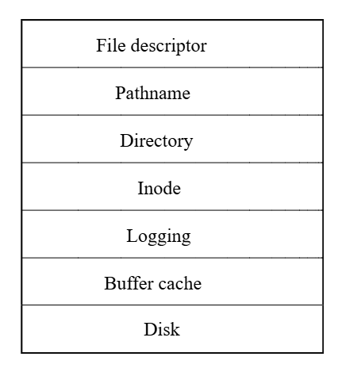

# xv6 riscv book chapter 8：File system

檔案系統的目的是為了組織與儲存資料。 檔案系統通常也會支援使用者與應用程式之間的資料共享，並具備資料的持久性，也就是在重新開機後資料仍然可用。 xv6 的檔案系統提供類 Unix 的檔案、目錄與路徑名稱（詳見第一章），並透過 virtio 硬碟來保存其資料以達成持久性。 這個檔案系統需要面對數個挑戰：

- 檔案系統需要在硬碟上建立資料結構，來表示具名目錄與檔案所組成的樹狀結構，記錄每個檔案內容所使用的區塊位置，並追蹤硬碟中哪些區域尚未被使用
- 檔案系統必須支援當機復原（crash recovery）。 也就是說，如果系統當機（例如電源故障）時中斷了操作，重新啟動後檔案系統仍必須能夠正常運作。 當機的風險在於，它可能會中斷一連串更新操作，使硬碟上的資料結構處於不一致的狀態（例如某個區塊既被某個檔案使用，又同時被標記為未使用）
- 不同的 process 可能會同時操作檔案系統，因此檔案系統的程式碼必須協調彼此之間的動作，以維護資料的一致性與不變性條件
- 存取硬碟的速度遠比存取記憶體慢上好幾個數量級，因此檔案系統必須在記憶體中維護一個常用區塊的快取

本章接下來將說明 xv6 是如何解決這些挑戰的

## 8.1 Overview

xv6 的檔案系統實作被劃分為七個層次，如圖 8.1 所示。 最底層是硬碟層，負責對 virtio 硬碟進行區塊的讀寫。 buffer cache 層會對磁碟區塊進行快取，並協調對其的存取，確保同一時間只有一個 kernel process 可以修改某個特定區塊中的資料。 logging 層允許更高層級的程式將多個區塊的更新包裝成一個 transaction，並保證在系統當機的情況下這些更新能夠以原子性方式完成（也就是要麼全部更新，要麼全部不更新）

inode 層提供單一檔案的表示方式，每個檔案由一個 inode 表示，具有唯一的 i-number，以及一些儲存檔案內容的區塊。 directory 層把每個目錄實作成一種特殊的 inode，它的內容是一串目錄項目，每個項目包含一個檔案名稱與對應的 i-number。 pathname 層提供階層式路徑名稱，例如 `/usr/rtm/xv6/fs.c`，並透過遞迴查找來解析這些路徑。 file descriptor 層則將許多 Unix 資源（例如 pipe、裝置、檔案等）抽象成使用檔案系統介面的方式，讓應用程式開發者的工作變得更簡單



硬碟硬體傳統上會將磁碟上的資料呈現為一個個 512-byte block（也稱為 sector）的編號序列：sector 0 是最前面的 512 bytes，sector 1 是接下來的 512 bytes，以此類推。 作業系統在檔案系統中使用的區塊大小可以與硬碟的 sector 大小不同，但通常會是 sector 大小的倍數。 xv6 會將讀取進記憶體的磁碟區塊儲存在型別為 `struct buf` 的物件中。 這些結構中的資料有時可能與實際磁碟上的資料不同步：例如資料可能還沒從磁碟中讀取完成（硬碟還在讀取中但尚未返回該 sector 的內容），或者資料已被軟體修改了但尚未寫回磁碟

檔案系統必須規劃好要將 inode 與資料區塊存放在哪些磁碟位置。 為了達成這點，xv6 將整個磁碟劃分成幾個區段，如圖 8.2 所示。 檔案系統不使用 block 0（因為它是 boot sector）。 block 1 被稱為 superblock，其中包含檔案系統的中繼資料（例如檔案系統的區塊總數、資料區塊的數量、inode 的數量，以及用於 log 的區塊數）

從 block 2 開始是用來存放 log 的區塊。 在 log 區塊之後是 inode 區段，每個區塊會存放多個 inode。 再往後是 bitmap 區塊，用來追蹤哪些資料區塊已被使用。 剩下的區塊就是資料區塊，每一個要嘛被 bitmap 標記為 free，要嘛用來儲存檔案或目錄的內容。 superblock 會由一個名為 `mkfs` 的獨立程式填寫，它會建立初始的檔案系統


本章接下來將依序介紹每個層次，從 buffer cache 開始。 請特別注意那些設計良好的底層抽象是如何讓高層的設計變得更簡潔的

## 8.2 Buffer cache layer

buffer cache 有兩個主要任務：第一是同步對磁碟區塊的存取，確保記憶體中對每個區塊只有一個拷貝，並且同一時間只有一個 kernel 執行緒會使用該拷貝； 第二是對常用的區塊進行快取，避免每次都要從緩慢的硬碟中重新讀取。 相關程式碼實作位於 `bio.c`

buffer cache 對外提供的主要介面包括 `bread` 與 `bwrite`； 前者會取得一個「buf」，也就是某個磁碟區塊在記憶體中的拷貝，這份資料可以被讀取或修改，而後者則會將修改過的 buffer 寫回對應的磁碟區塊。 當 kernel 執行緒使用完這個 buffer 後，必須呼叫 `brelse` 來釋放該 buffer。 buffer cache 為每個 buffer 使用一個 sleep-lock，以確保同一時間只有一個執行緒能使用某個 buffer（也就是某個磁碟區塊）； `bread` 會回傳一個已上鎖的 buffer，而 `brelse` 則會釋放該鎖

buffer cache 只有固定數量的 buffer 可用來儲存磁碟區塊，這表示如果檔案系統要求某個目前不在 cache 中的區塊，buffer cache 就必須回收一個目前用來儲存其他區塊的 buffer。 它會選擇最近最少使用（Least Recently Used, LRU）的那個 buffer 來回收並用於新的區塊。 這基於一個假設：最近最少使用的 buffer 很可能短期內也不會再被使用

## 8.3 Code: Buffer cache

buffer cache 是由多個 buffer 組成的 doubly-linked list。 `main` 函數會呼叫 `binit`（[kernel/main.c:27](https://github.com/mit-pdos/xv6-riscv/blob/riscv//kernel/main.c#L27)），並用靜態陣列 `buf` 中的 `NBUF` 個 buffer 初始化整個 doubly-linked list（[kernel/bio.c:43-52](https://github.com/mit-pdos/xv6-riscv/blob/riscv//kernel/bio.c#L43-L52)）。 在初始化之後，其他所有對 buffer cache 的存取都透過 `bcache.head` 指向的 linked list 來進行，而不再直接使用 `buf` 陣列

```c
void
binit(void)
{
  struct buf *b;

  initlock(&bcache.lock, "bcache");

  // Create linked list of buffers
  bcache.head.prev = &bcache.head;
  bcache.head.next = &bcache.head;
  for(b = bcache.buf; b < bcache.buf + NBUF; b++){
    b->next = bcache.head.next;
    b->prev = &bcache.head;
    initsleeplock(&b->lock, "buffer");
    bcache.head.next->prev = b;
    bcache.head.next = b;
  }
}
```

每個 buffer 都有兩個與其狀態有關的欄位。 `valid` 欄位表示這個 buffer 中目前包含了某個磁碟區塊的拷貝。 `disk` 欄位則表示該 buffer 的內容已經交由磁碟處理，也就是可能已經被磁碟寫入了（例如從磁碟讀資料到 `data` 陣列中）

```c
struct buf {
  int valid;   // has data been read from disk?
  int disk;    // does disk "own" buf?
  uint dev;
  uint blockno;
  struct sleeplock lock;
  uint refcnt;
  struct buf *prev; // LRU cache list
  struct buf *next;
  uchar data[BSIZE];
};
```

`bread`（[kernel/bio.c:93](https://github.com/mit-pdos/xv6-riscv/blob/riscv//kernel/bio.c#L93)）會呼叫 `bget` 來取得對應於某個 sector 的 buffer（[kernel/bio.c:97](https://github.com/mit-pdos/xv6-riscv/blob/riscv//kernel/bio.c#L97)）。 若這個 buffer 需要從磁碟讀取資料，`bread` 會呼叫 `virtio_disk_rw` 來執行讀取，然後才回傳這個 buffer

```c
// Return a locked buf with the contents of the indicated block.
struct buf*
bread(uint dev, uint blockno)
{
  struct buf *b;

  b = bget(dev, blockno);
  if(!b->valid) {
    virtio_disk_rw(b, 0);
    b->valid = 1;
  }
  return b;
}
```

`bget`（[kernel/bio.c:59](https://github.com/mit-pdos/xv6-riscv/blob/riscv//kernel/bio.c#L59)）會掃描整個 buffer list，尋找一個擁有指定裝置號與 sector 編號的 buffer（[kernel/bio.c:65-73](https://github.com/mit-pdos/xv6-riscv/blob/riscv//kernel/bio.c#L65-L73)）。 若有找到，`bget` 會為該 buffer 取得 sleep-lock，然後回傳這個已上鎖的 buffer

如果該 sector 沒有對應的快取 buffer，`bget` 就必須建一個新的，這可能會重複使用目前儲存其他 sector 的 buffer。 接著它會再掃描一次 buffer list，尋找一個未被使用的 buffer（`b->refcnt = 0`）； 只要符合這個條件就可以使用。 `bget` 接著會更新這個 buffer 的中繼資料，將其裝置編號與 sector 編號改成新的，並且為它上鎖。 特別注意，`b->valid = 0` 這行會強制讓 `bread` 之後從磁碟重新讀取資料，而不是錯誤地使用這個 buffer 之前的內容

每個 sector 最多只能有一個對應的快取 buffer，這點非常重要，因為這樣才能保證讀取端能看到寫入端的更新結果，同時檔案系統也仰賴對 buffer 上鎖來實現同步機制。 `bget` 為了確保這個不變性，會在執行第一次檢查（判斷某個區塊是否已存在於 cache）到第二次回收並設為新的 buffer 的整個過程中，持續持有 `bcache.lock`。 這個過程中會設定該 buffer 的 `dev`、`blockno` 與 `refcnt`。 這種設計可以讓「檢查快取是否存在」與「指定一個 buffer 來存放該區塊」這兩個步驟形成一個原子操作

```c
// Look through buffer cache for block on device dev.
// If not found, allocate a buffer.
// In either case, return locked buffer.
static struct buf*
bget(uint dev, uint blockno)
{
  struct buf *b;

  acquire(&bcache.lock);

  // Is the block already cached?
  for(b = bcache.head.next; b != &bcache.head; b = b->next){
    if(b->dev == dev && b->blockno == blockno){
      b->refcnt++;
      release(&bcache.lock);
      acquiresleep(&b->lock);
      return b;
    }
  }

  // Not cached.
  // Recycle the least recently used (LRU) unused buffer.
  for(b = bcache.head.prev; b != &bcache.head; b = b->prev){
    if(b->refcnt == 0) {
      b->dev = dev;
      b->blockno = blockno;
      b->valid = 0;
      b->refcnt = 1;
      release(&bcache.lock);
      acquiresleep(&b->lock);
      return b;
    }
  }
  panic("bget: no buffers");
}
```

`bget` 在離開 `bcache.lock` 的 critical section 之後再去取得 buffer 的 sleep-lock 是安全的，因為只要 `b->refcnt` 不為 0，就可以防止該 buffer 被重複用於其他磁碟區塊。 sleep-lock 用來保護對這個區塊內容的讀寫操作，而 `bcache.lock` 則用來保護「哪些磁碟區塊已被快取」的相關資訊

如果所有的 buffer 都在忙碌中，表示有太多 process 同時在執行檔案系統呼叫了； 這時 `bget` 會直接 panic。 比較溫和的處理方式是讓該 process 睡眠直到有 buffer 變得可用，但這樣會有導致 deadlock 的可能性

一旦 `bread`（若有需要）從磁碟讀取資料並回傳 buffer 給呼叫者，呼叫者就能獨佔這個 buffer，可以任意讀取或寫入裡面的資料。 如果呼叫者修改了 buffer，就必須呼叫 `bwrite` 將變更寫回磁碟，然後才能釋放 buffer。 `bwrite`（[kernel/bio.c:107](https://github.com/mit-pdos/xv6-riscv/blob/riscv//kernel/bio.c#L107)）會呼叫 `virtio_disk_rw` 與磁碟硬體溝通

當呼叫者使用完一個 buffer 時，必須呼叫 `brelse` 來釋放它（`brelse` 這個名稱是 b-release 的縮寫，雖然不好懂，但很值得學，因為它來自 Unix，並在 BSD、Linux、Solaris 等系統中沿用至今）。 `brelse`（[kernel/bio.c:117](https://github.com/mit-pdos/xv6-riscv/blob/riscv//kernel/bio.c#L117)）會釋放這個 buffer 的 sleep-lock，並將它移動到 linked list 的最前面（[kernel/bio.c:128-133](https://github.com/mit-pdos/xv6-riscv/blob/riscv//kernel/bio.c#L128-L133)）。 這讓整個 list 會根據 buffer 最近被使用的時間進行排序：list 最前面是最近被釋放的 buffer，最尾端是最久未使用的

```c
// Release a locked buffer.
// Move to the head of the most-recently-used list.
void
brelse(struct buf *b)
{
  if(!holdingsleep(&b->lock))
    panic("brelse");

  releasesleep(&b->lock);

  acquire(&bcache.lock);
  b->refcnt--;
  if (b->refcnt == 0) {
    // no one is waiting for it.
    b->next->prev = b->prev;
    b->prev->next = b->next;
    b->next = bcache.head.next;
    b->prev = &bcache.head;
    bcache.head.next->prev = b;
    bcache.head.next = b;
  }
  
  release(&bcache.lock);
}
```

`bget` 中的兩段迴圈就是利用了這種排序方式：在尋找既有 buffer 的那一段，最糟情況下會掃過整個 list，但若有良好的區域性參考性（locality），從 `bcache.head` 開始沿著 next 指標往後找，就能縮短搜尋時間。 而在找出可回收 buffer 的那段，則是從 list 的尾端開始，沿著 `prev` 指標反向找，選出最久未使用的 buffer

## 8.4 Logging layer

在檔案系統設計中，當機復原（crash recovery）是一個非常有趣的問題。 這個問題的來自於許多檔案系統的操作會包含多次對硬碟的寫入，如果在這些寫入只完成一部分時系統發生當機，那麼硬碟上的檔案系統可能會變成不一致的狀態。 例如，假設當機發生在執行 file truncation（將檔案長度設為 0 並釋放其內容區塊）的過程中。 根據磁碟寫入的順序不同，當機後可能會出現以下兩種情況之一：第一種是 inode 仍然指向某個實際上已被標記為「空閒」的區塊，第二種是某個區塊已被配置但卻沒有任何 inode 參考它

第二種情況相對比較無害，但若某個 inode 仍然指向一個已被釋放的區塊，這在重新開機後很可能會引發嚴重的問題。 因為在重新開機之後，kernel 可能會把該區塊分配給另一個檔案，結果就變成兩個不同的檔案意外地指向同一個區塊。 如果 xv6 有支援多個使用者，這樣的狀況甚至可能變成一個安全漏洞，因為原本的檔案擁有者就可以讀寫新的、屬於其他使用者的檔案資料

xv6 使用一種簡化的 logging 機制來解決檔案系統操作期間可能發生當機的問題。 xv6 的系統呼叫並不會直接修改硬碟上的檔案系統資料結構，而是先將所有預計要寫入的內容描述記錄到硬碟上的 log 中。 等到所有寫入動作都被記錄到 log 之後，系統呼叫會在磁碟上寫入一個特殊的 commit 記錄，表示 log 內包含了一筆完整的操作。 到了這個階段，系統呼叫才會把這些寫入實際套用到檔案系統的資料結構上。 當這些寫入完成之後，系統呼叫會刪除磁碟上的 log

如果系統發生當機並重新啟動，檔案系統的程式會在執行任何 process 之前先進行以下的復原程序。 若 log 被標記為包含一筆完整的操作，那麼復原程式就會將這筆操作所對應的寫入內容複製到對應的檔案系統資料結構中。 反之，如果 log 沒有被標記為包含完整操作，復原程式就會忽略這份 log。 最後，復原程式會將 log 從磁碟上清除

xv6 的 log 能解決檔案系統操作期間發生當機的問題的原因是，如果當機發生在操作完成 commit 之前，那麼磁碟上的 log 不會被標記為完成，復原程式就會忽略它，此時硬碟的狀態就像這筆操作根本沒開始過一樣。 如果當機發生在操作 commit 之後，那麼復原程式會重播這筆操作的所有寫入，儘管在當機之前這些寫入可能已經部分套用到其資料結構中了。 無論是哪種情況，這個 log 都讓檔案系統的操作在面對當機時具有原子性：在復原之後，要嘛這筆操作的所有寫入都存在磁碟上，要嘛一個寫入都沒有
